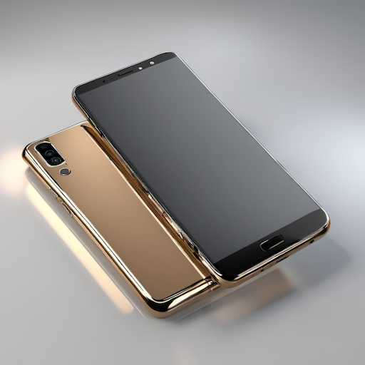
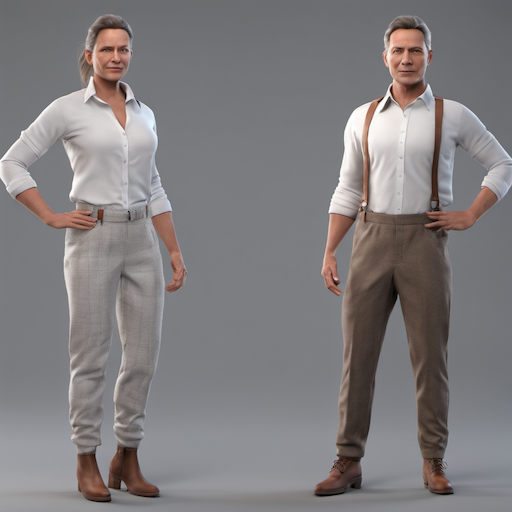
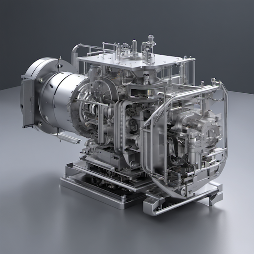

# 3D Render & CGI Style Prompt Guide

## Core Principles

### 1. **3D Render Aesthetics**

- Three-dimensional depth and perspective
- Realistic lighting and materials
- Precise geometric forms
- Professional rendering quality
- Computer-generated appearance

### 2. **CGI Elements**

- **Product Visualization**: Clean, commercial quality
- **Architectural**: Detailed building renders
- **Character Animation**: Lifelike 3D characters
- **Environmental**: Complex 3D environments

### 3. **Rendering Styles**

- **Photorealistic**: Indistinguishable from photography
- **Stylized**: Artistic interpretation with 3D techniques
- **Low Poly**: Geometric, minimalist 3D
- **Isometric**: Technical, diagram-like renders

## Essential Prompt Structure

### Base Template

```text
[subject/scene], [3d technique], [lighting], [materials], [perspective], [render style], [quality], [purpose]
```

### Example

A modern chair in a minimalist room, 3D render with studio lighting, chrome and leather materials, three-quarter perspective, photorealistic render style, high quality, product visualization

## Advanced Techniques

### 1. **3D Modeling Elements**

- **Geometry**: "precise geometry, clean edges, smooth surfaces, geometric forms"
- **Materials**: "chrome material, glass material, wood texture, fabric material"
- **Surfaces**: "smooth surface, textured surface, reflective surface, matte finish"
- **Details**: "detailed model, high-poly model, intricate details, fine geometry"

### 2. **Lighting Systems**

- **Studio**: "studio lighting, three-point lighting, professional lighting, commercial lighting"
- **Natural**: "natural lighting, sunlight, ambient lighting, environmental lighting"
- **Dramatic**: "dramatic lighting, rim lighting, backlighting, moody lighting"
- **Technical**: "technical lighting, even lighting, flat lighting, diagram lighting"

### 3. **Rendering Techniques**

- **Photorealistic**: "photorealistic render, realistic materials, accurate lighting, true-to-life"
- **Stylized**: "stylized render, artistic interpretation, non-photorealistic, creative 3D"
- **Technical**: "technical render, diagram style, blueprint style, schematic render"
- **Commercial**: "commercial render, product visualization, marketing render, professional 3D"

### 4. **Camera and Perspective**

- **Angles**: "three-quarter view, front view, side view, top-down view"
- **Lenses**: "wide-angle lens, telephoto lens, normal lens, perspective camera"
- **Depth**: "depth of field, shallow focus, deep focus, 3D depth"
- **Composition**: "rule of thirds, centered composition, dynamic angle, professional framing"

## Style-Specific Modifiers

### 3D Render Quality Enhancers

```text
3D render, CGI, computer generated, 3D visualization, photorealistic render, professional 3D, high-quality render, 3D modeling, digital 3D
```

### Software References

```text
Blender render, Maya render, 3ds Max render, Cinema 4D render, V-Ray render, Arnold render, Octane render, Redshift render
```

## Negative Prompts

### Essential 3D Render Negatives

```text
2D art, painting, drawing, illustration, traditional art, hand-drawn, low quality, blurry, pixelated, deformed, bad anatomy, extra limbs, missing fingers, fused body parts, bad proportions, poorly drawn
```

### Advanced Negatives

```text
watercolor, oil painting, acrylic painting, sketch, cartoon, anime, manga, flat design, minimalist art
```

## Sample Prompts by Category

### Product Visualization

```text
A sleek smartphone on a white surface, 3D render with studio lighting, glass and metal materials, three-quarter perspective, photorealistic render style, high quality, product visualization
```

### Architectural Render

```text
A modern house exterior, 3D render with natural lighting, concrete and glass materials, wide-angle perspective, photorealistic render style, high quality, architectural visualization
```

### Character Render

```text
A detailed 3D character model, standing pose with studio lighting, realistic skin and fabric materials, front view, photorealistic render style, high quality, character visualization
```

## 10 Example Prompts

### 1. Product Visualization

```text
A sleek smartphone on a white surface, 3D render with studio lighting, glass and metal materials, three-quarter perspective, photorealistic render style, high quality, product visualization
```



### 2. Architectural Render

```text
A modern house exterior, 3D render with natural lighting, concrete and glass materials, wide-angle perspective, photorealistic render style, high quality, architectural visualization
```


### 3. Character Render

```text
A detailed 3D character model, standing pose with studio lighting, realistic skin and fabric materials, front view, photorealistic render style, high quality, character visualization
```



### 4. Interior Design

```text
A modern living room interior, 3D render with natural lighting, wood and fabric materials, wide-angle perspective, photorealistic render style, high quality, interior visualization
```


### 5. Automotive Render

```text
A luxury car on a reflective surface, 3D render with studio lighting, metal and glass materials, three-quarter perspective, photorealistic render style, high quality, automotive visualization
```


### 6. Furniture Render

```text
A modern chair in a minimalist room, 3D render with studio lighting, chrome and leather materials, three-quarter perspective, photorealistic render style, high quality, furniture visualization
```


### 7. Landscape Render

```text
A natural landscape with trees and mountains, 3D render with natural lighting, organic materials, wide-angle perspective, photorealistic render style, high quality, landscape visualization
```


### 8. Technical Diagram

```text
A technical diagram of a machine, 3D render with even lighting, metal materials, isometric perspective, technical render style, high quality, technical visualization
```



### 9. Stylized Character

```text
A stylized 3D character model, dynamic pose with dramatic lighting, colorful materials, three-quarter perspective, stylized render style, high quality, character visualization
```


### 10. Commercial Scene

```text
A commercial scene with multiple products, 3D render with studio lighting, various materials, wide-angle perspective, commercial render style, high quality, marketing visualization
```


## Advanced Tips

### 1. **Material Specificity**

- "chrome material" for metallic surfaces
- "glass material" for transparent objects
- "fabric material" for cloth textures
- "wood material" for natural surfaces

### 2. **Lighting Quality**

- "studio lighting" for commercial quality
- "natural lighting" for realistic environments
- "dramatic lighting" for artistic impact
- "even lighting" for technical diagrams

### 3. **Rendering Quality**

- "photorealistic" for true-to-life appearance
- "high-quality render" for professional results
- "detailed render" for intricate models
- "clean render" for minimal artifacts

### 4. **Purpose Specificity**

- "product visualization" for commercial use
- "architectural visualization" for building renders
- "character visualization" for 3D characters
- "technical visualization" for diagrams

## Common Mistakes to Avoid

1. **2D terms**: Avoid painting or drawing terminology
2. **Poor materials**: Use specific 3D material descriptions
3. **Inconsistent lighting**: Maintain 3D-appropriate lighting
4. **Missing perspective**: Include 3D perspective information
5. **Generic quality**: Specify rendering quality and technique

Remember: 3D renders and CGI emphasize three-dimensional depth, realistic materials, and professional rendering quality. Focus on geometric precision, material properties, and lighting systems while maintaining the distinctive 3D aesthetic.
