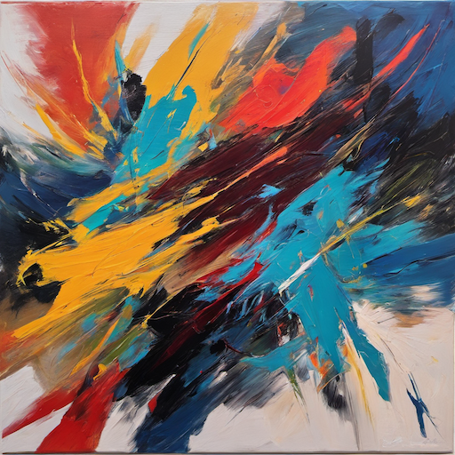
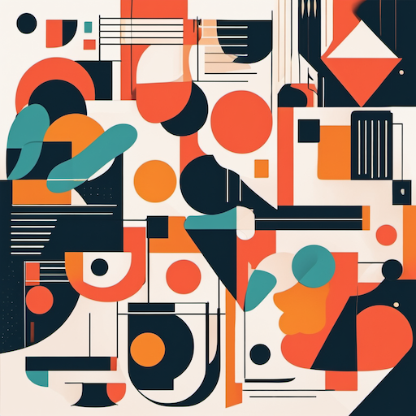
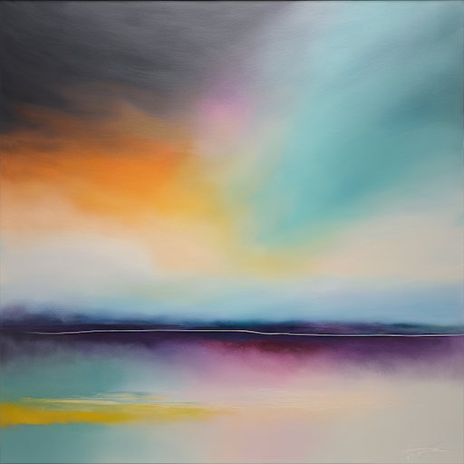

# Abstract Art Style Prompt Guide

## Core Principles

### 1. **Abstract Art Aesthetics**

- Non-representational forms and shapes
- Focus on color, line, and composition
- Emotional and expressive content
- Freedom from realistic representation
- Artistic interpretation and creativity

### 2. **Abstract Art Movements**

- **Expressionism**: Emotional, gestural, intense
- **Cubism**: Geometric, fragmented, analytical
- **Minimalism**: Simple, clean, essential elements
- **Color Field**: Large areas of color, atmospheric

### 3. **Abstract Techniques**

- **Gestural**: Free-flowing, expressive brushwork
- **Geometric**: Precise shapes, mathematical composition
- **Organic**: Natural, flowing, biomorphic forms
- **Textural**: Surface quality, material exploration

## Essential Prompt Structure

### Base Template:

```text
[abstract elements], [composition style], [color palette], [technique], [abstract style], [quality], [mood/emotion]
```

### Example:

```text
Abstract geometric shapes, dynamic composition with bold colors, gestural brushwork, expressionist abstract art style, high quality, energetic mood
```

## Advanced Techniques

### 1. **Abstract Elements**

- **Shapes**: "geometric shapes, organic forms, abstract shapes, flowing forms"
- **Lines**: "dynamic lines, gestural lines, geometric lines, flowing lines"
- **Colors**: "bold colors, vibrant palette, contrasting colors, harmonious colors"
- **Textures**: "textured surface, paint texture, material texture, surface quality"

### 2. **Composition Styles**

- **Dynamic**: "dynamic composition, energetic layout, movement, flow"
- **Balanced**: "balanced composition, harmonious layout, equilibrium, stability"
- **Asymmetrical**: "asymmetrical composition, off-center, dynamic balance"
- **Minimal**: "minimal composition, essential elements, clean layout, simple design"

### 3. **Color Strategies**

- **Bold**: "bold colors, vibrant palette, intense colors, dramatic color"
- **Subtle**: "subtle colors, muted palette, soft colors, gentle tones"
- **Contrasting**: "contrasting colors, complementary colors, color opposition"
- **Harmonious**: "harmonious colors, color harmony, unified palette, cohesive colors"

### 4. **Technique Variations**

- **Gestural**: "gestural painting, expressive brushwork, free-flowing, emotional"
- **Geometric**: "geometric painting, precise shapes, mathematical, structured"
- **Organic**: "organic forms, natural shapes, flowing, biomorphic"
- **Textural**: "textured painting, surface quality, material exploration, tactile"

## Style-Specific Modifiers

### Abstract Art Quality Enhancers:

```text
abstract art, abstract painting, abstract composition, abstract design, contemporary abstract, modern abstract, abstract expressionism, abstract art style
```

### Artist References:

```text
Jackson Pollock style, Mark Rothko style, Piet Mondrian style, Wassily Kandinsky style, abstract expressionist, modern abstract artist
```

## Negative Prompts

### Essential Abstract Negatives:

```text
realistic, representational, figurative, recognizable objects, photographic, literal, low quality, blurry, pixelated, deformed, bad anatomy, extra limbs, missing fingers, fused body parts, bad proportions, poorly drawn
```

### Advanced Negatives:

```text
traditional art, classical art, realistic painting, figurative art, representational art, literal interpretation
```

## Sample Prompts by Category

### Expressionist Abstract

```text
Abstract gestural painting, dynamic composition with bold brushstrokes, vibrant color palette, expressive technique, abstract expressionist style, high quality, emotional intensity
```

### Geometric Abstract

```text
Abstract geometric composition, precise shapes and lines, contrasting color palette, structured technique, geometric abstract art style, high quality, mathematical beauty
```

### Color Field Abstract

```text
Abstract color field painting, large areas of color, subtle color transitions, atmospheric technique, color field abstract art style, high quality, meditative mood
```

## 10 Example Prompts

### 1. Expressionist Abstract

```text
Abstract gestural painting, dynamic composition with bold brushstrokes, vibrant color palette, expressive technique, abstract expressionist style, high quality, emotional intensity
```



### 2. Geometric Abstract

```text
Abstract geometric composition, precise shapes and lines, contrasting color palette, structured technique, geometric abstract art style, high quality, mathematical beauty
```



### 3. Color Field Abstract

```text
Abstract color field painting, large areas of color, subtle color transitions, atmospheric technique, color field abstract art style, high quality, meditative mood
```



### 4. Minimalist Abstract

```text
Abstract minimalist composition, essential elements only, limited color palette, clean technique, minimalist abstract art style, high quality, serene mood
```


### 5. Organic Abstract

```text
Abstract organic forms, flowing composition with natural shapes, harmonious color palette, fluid technique, organic abstract art style, high quality, natural mood
```


### 6. Textural Abstract

```text
Abstract textural painting, rich surface quality with material exploration, earthy color palette, tactile technique, textural abstract art style, high quality, tactile mood
```


### 7. Dynamic Abstract

```text
Abstract dynamic composition, energetic movement with flowing lines, bold color palette, gestural technique, dynamic abstract art style, high quality, energetic mood
```


### 8. Harmonious Abstract

```text
Abstract harmonious composition, balanced elements with unified colors, soft color palette, gentle technique, harmonious abstract art style, high quality, peaceful mood
```


### 9. Contrasting Abstract

```text
Abstract contrasting composition, opposing elements with dramatic colors, bold color palette, dramatic technique, contrasting abstract art style, high quality, intense mood
```


### 10. Atmospheric Abstract

```text
Abstract atmospheric painting, ethereal composition with subtle colors, soft color palette, atmospheric technique, atmospheric abstract art style, high quality, dreamy mood
```


## Advanced Tips

### 1. **Emotional Expression**

- "emotional intensity" for expressive abstract
- "meditative mood" for contemplative abstract
- "energetic mood" for dynamic abstract
- "calm atmosphere" for peaceful abstract

### 2. **Composition Quality**

- "dynamic composition" for movement and energy
- "balanced composition" for harmony and stability
- "minimal composition" for essential elements
- "complex composition" for intricate abstract

### 3. **Color Theory**

- "color harmony" for unified palette
- "color contrast" for dramatic effect
- "color flow" for smooth transitions
- "color intensity" for bold impact

### 4. **Technique Specificity**

- "gestural painting" for expressive technique
- "geometric painting" for structured technique
- "organic painting" for natural forms
- "textural painting" for surface quality

## Common Mistakes to Avoid

1. **Representational elements**: Avoid recognizable objects or figures
2. **Literal interpretation**: Focus on abstract, non-representational forms
3. **Poor composition**: Maintain strong abstract composition principles
4. **Inconsistent style**: Keep abstract aesthetic throughout
5. **Missing emotion**: Include emotional or expressive elements

Remember: Abstract art emphasizes non-representational forms, emotional expression, and artistic creativity. Focus on color, composition, and technique while avoiding literal or realistic representation. 