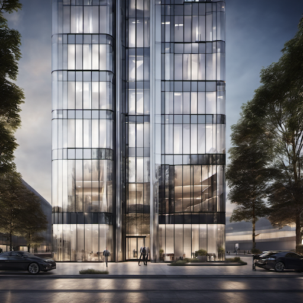
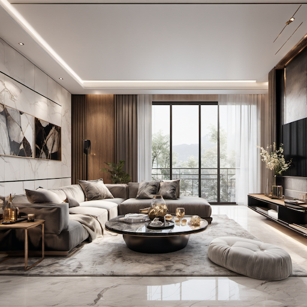
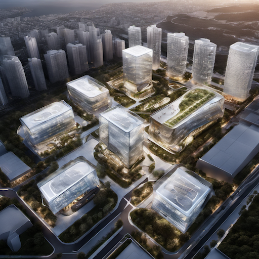
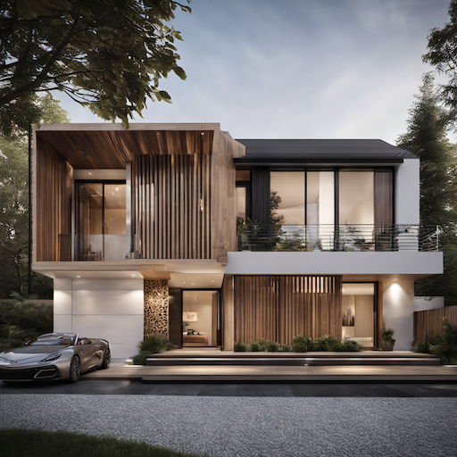
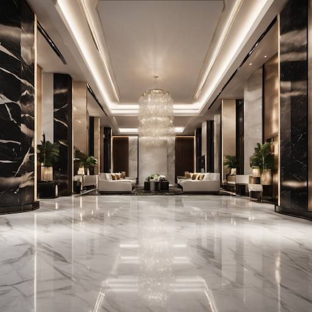
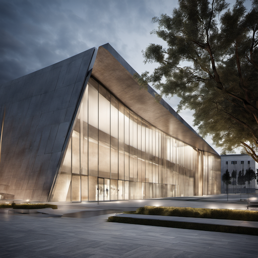
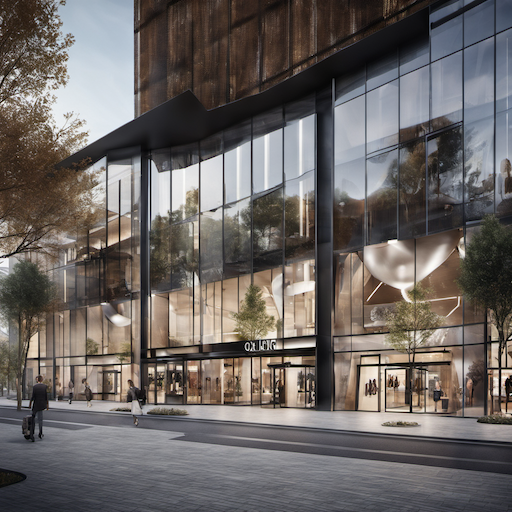
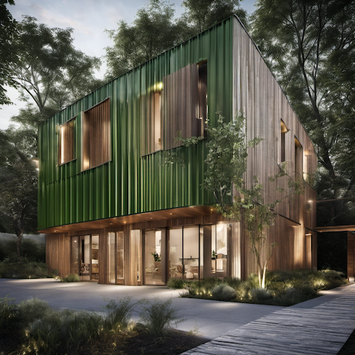
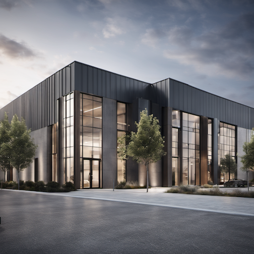
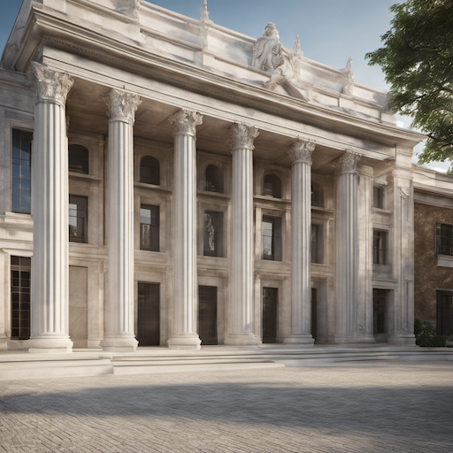

# Architectural Visualization Style Prompt Guide

## Core Principles

### 1. **Architectural Aesthetics**

- Clean, precise building forms
- Professional presentation quality
- Accurate scale and proportions
- Modern or classical architectural styles
- Environmental integration

### 2. **Visualization Types**

- **Exterior Renders**: Building facades and landscapes
- **Interior Renders**: Room layouts and finishes
- **Master Plans**: Site planning and urban design
- **Detail Views**: Architectural elements and materials

### 3. **Presentation Styles**

- **Photorealistic**: Indistinguishable from photography
- **Stylized**: Artistic interpretation with architectural accuracy
- **Technical**: Diagram-like with precise measurements
- **Marketing**: Commercial quality for real estate

## Essential Prompt Structure

### Base Template

```text
[building type], [architectural style], [view type], [lighting], [materials], [visualization style], [quality], [purpose]
```

### Example

```text
A modern glass office building, contemporary architecture, exterior view with natural lighting, steel and glass materials, photorealistic architectural visualization, high quality, commercial presentation
```

## Advanced Techniques

### 1. **Building Types**

- **Residential**: "modern house, luxury villa, apartment building, townhouse"
- **Commercial**: "office building, retail center, hotel, restaurant"
- **Institutional**: "museum, library, school, hospital"
- **Industrial**: "factory, warehouse, office park, mixed-use development"

### 2. **Architectural Styles**

- **Modern**: "contemporary architecture, modern design, minimalist building, clean lines"
- **Classical**: "classical architecture, traditional design, neoclassical building, ornate details"
- **Industrial**: "industrial architecture, warehouse style, loft building, exposed structure"
- **Sustainable**: "green building, sustainable design, eco-friendly architecture, LEED certified"

### 3. **View Types**

- **Exterior**: "exterior view, building facade, street view, aerial view"
- **Interior**: "interior view, room layout, space planning, interior design"
- **Detail**: "architectural detail, material close-up, construction detail, building element"
- **Context**: "site context, urban environment, landscape integration, neighborhood view"

### 4. **Lighting Systems**

- **Natural**: "natural lighting, daylight, golden hour, overcast lighting"
- **Artificial**: "artificial lighting, interior lighting, LED lighting, architectural lighting"
- **Dramatic**: "dramatic lighting, sunset lighting, mood lighting, atmospheric lighting"
- **Technical**: "even lighting, technical lighting, diagram lighting, presentation lighting"

## Style-Specific Modifiers

### Architectural Quality Enhancers

```text
architectural visualization, architectural render, building visualization, architectural illustration, professional architecture, architectural photography, building design, architectural presentation
```

### Software References

```text
3ds Max render, V-Ray render, Corona render, Lumion render, SketchUp render, Revit render, architectural software
```

## Negative Prompts

### Essential Architectural Negatives

```text
low quality, blurry, pixelated, deformed, bad proportions, unrealistic, fantasy, impossible architecture, cartoon, anime, painting, drawing, illustration
```

### Advanced Negatives

```text
amateur photography, poor lighting, bad composition, unrealistic materials, impossible physics, fantasy building
```

## Sample Prompts by Category

### Modern Office Building

```text
A sleek glass office tower, contemporary architecture, exterior view with natural lighting, steel and glass materials, photorealistic architectural visualization, high quality, commercial presentation
```

### Luxury Interior

```text
A modern luxury apartment interior, contemporary design, living room view with natural lighting, marble and wood materials, photorealistic interior visualization, high quality, real estate marketing
```

### Urban Master Plan

```text
A mixed-use urban development, modern architecture, aerial view with natural lighting, concrete and glass materials, architectural master plan visualization, high quality, urban planning presentation
```

## 10 Example Prompts

### 1. Modern Office Building

```text
A sleek glass office tower, contemporary architecture, exterior view with natural lighting, steel and glass materials, photorealistic architectural visualization, high quality, commercial presentation
```



### 2. Luxury Interior

```text
A modern luxury apartment interior, contemporary design, living room view with natural lighting, marble and wood materials, photorealistic interior visualization, high quality, real estate marketing
```



### 3. Urban Master Plan

```text
A mixed-use urban development, modern architecture, aerial view with natural lighting, concrete and glass materials, architectural master plan visualization, high quality, urban planning presentation
```



### 4. Residential House

```text
A modern residential house, contemporary architecture, exterior view with natural lighting, wood and stone materials, photorealistic architectural visualization, high quality, residential presentation
```



### 5. Hotel Interior

```text
A luxury hotel lobby, contemporary design, interior view with artificial lighting, marble and glass materials, photorealistic interior visualization, high quality, hospitality presentation
```



### 6. Museum Building

```text
A modern museum building, contemporary architecture, exterior view with dramatic lighting, concrete and glass materials, photorealistic architectural visualization, high quality, cultural presentation
```



### 7. Retail Center

```text
A modern retail center, contemporary architecture, exterior view with natural lighting, steel and glass materials, photorealistic architectural visualization, high quality, commercial presentation
```



### 8. Sustainable Building

```text
A green building, sustainable architecture, exterior view with natural lighting, eco-friendly materials, photorealistic architectural visualization, high quality, environmental presentation
```



### 9. Industrial Facility

```text
A modern industrial facility, contemporary architecture, exterior view with natural lighting, concrete and steel materials, photorealistic architectural visualization, high quality, industrial presentation
```



### 10. Classical Building

```text
A classical building, traditional architecture, exterior view with natural lighting, stone and marble materials, photorealistic architectural visualization, high quality, heritage presentation
```



## Advanced Tips

### 1. **Material Specificity**

- "glass facade" for modern buildings
- "concrete structure" for industrial style
- "stone cladding" for classical buildings
- "wood paneling" for warm interiors

### 2. **Lighting Quality**

- "natural daylight" for realistic exteriors
- "interior lighting" for room renders
- "golden hour" for dramatic exteriors
- "even lighting" for technical presentations

### 3. **Scale and Context**

- "human scale" for relatable proportions
- "urban context" for city environments
- "landscape integration" for natural settings
- "site planning" for master plans

### 4. **Presentation Purpose**

- "marketing visualization" for real estate
- "technical presentation" for construction
- "design development" for architects
- "planning approval" for government

## Common Mistakes to Avoid

1. **Unrealistic proportions**: Maintain accurate architectural scale
2. **Poor lighting**: Use appropriate lighting for the building type
3. **Inconsistent materials**: Ensure material compatibility
4. **Missing context**: Include environmental and site context
5. **Low quality**: Maintain professional presentation standards

Remember: Architectural visualization emphasizes accuracy, professionalism, and clear communication of design intent. Focus on precise proportions, appropriate materials, and professional presentation while maintaining architectural authenticity.
