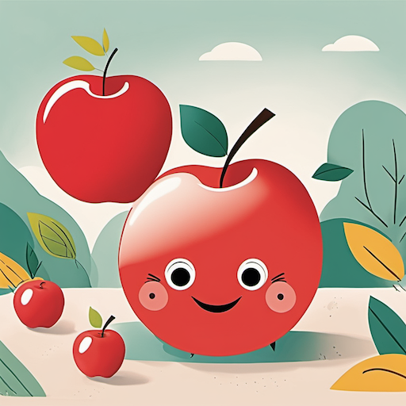
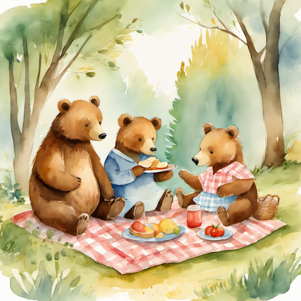
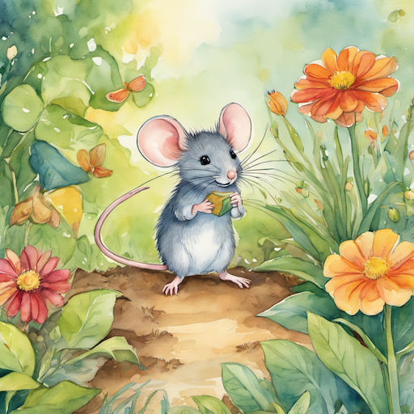
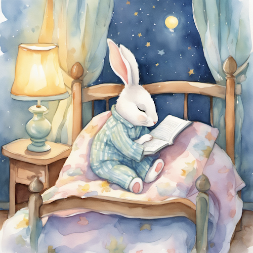
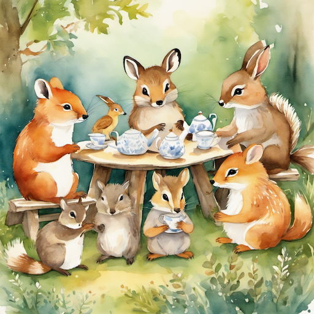
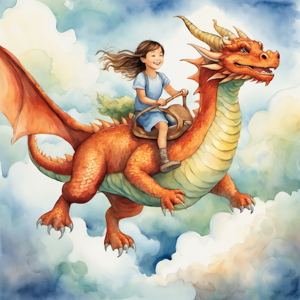
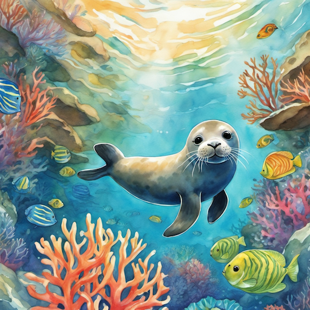

# Children's Book Illustration Style Prompt Guide

## Core Principles

### 1. **Children's Book Aesthetics**

- Warm, inviting color palettes
- Simple, clear compositions
- Friendly, approachable characters
- Whimsical and imaginative elements
- Age-appropriate content and style

### 2. **Age Group Considerations**

- **Toddlers (0-3)**: Simple shapes, bright colors, minimal detail
- **Preschool (3-5)**: Friendly characters, clear stories, engaging colors
- **Early Readers (5-8)**: More detailed scenes, character development
- **Middle Grade (8-12)**: Complex illustrations, rich environments

### 3. **Illustration Styles**

- **Classic**: Traditional watercolor and painting techniques
- **Modern**: Contemporary digital illustration
- **Whimsical**: Playful, imaginative, dreamlike
- **Educational**: Clear, informative, learning-focused

## Essential Prompt Structure

### Base Template:

```
[scene/subject], [age group], [style], [color palette], [mood], [children's book style], [quality], [story element]
```

### Example:

```
A friendly bear reading a book to forest animals, preschool age group, warm watercolor style, soft earth tones, cozy mood, children's book illustration style, high quality, bedtime story scene
```

## Advanced Techniques

### 1. **Character Design**

- **Friendly**: "friendly character, warm expression, approachable face, gentle features"
- **Animals**: "cute animals, anthropomorphic characters, friendly creatures, woodland animals"
- **Children**: "happy children, playful expressions, safe and friendly, age-appropriate"
- **Fantasy**: "magical creatures, friendly monsters, whimsical beings, fantasy characters"

### 2. **Environment Elements**

- **Nature**: "forest scene, garden setting, outdoor environment, natural world"
- **Home**: "cozy home, bedroom scene, kitchen setting, family environment"
- **Fantasy**: "magical world, enchanted forest, fairy tale setting, imaginary place"
- **School**: "classroom setting, playground, learning environment, educational scene"

### 3. **Color Strategies**

- **Warm**: "warm colors, soft earth tones, gentle palette, comforting colors"
- **Bright**: "bright colors, vibrant palette, cheerful colors, engaging hues"
- **Pastel**: "pastel colors, soft palette, gentle tones, soothing colors"
- **Seasonal**: "spring colors, autumn palette, winter tones, summer hues"

### 4. **Storytelling Elements**

- **Narrative**: "story scene, narrative illustration, plot moment, character interaction"
- **Educational**: "learning scene, educational illustration, teaching moment, discovery scene"
- **Emotional**: "emotional scene, feeling illustration, mood setting, character emotion"
- **Interactive**: "action scene, movement illustration, dynamic moment, engaging scene"

## Style-Specific Modifiers

### Children's Book Quality Enhancers:

```
children's book illustration, children's art, kid-friendly illustration, storybook art, children's book art, family-friendly art, educational illustration, children's literature
```

### Artist References:

```
Beatrix Potter style, Dr. Seuss style, Eric Carle style, Maurice Sendak style, children's book illustrator, storybook artist
```

## Negative Prompts

### Essential Children's Book Negatives:

```
dark, scary, frightening, violent, adult content, mature themes, complex, confusing, low quality, blurry, pixelated, deformed, bad anatomy, extra limbs, missing fingers, fused body parts, bad proportions, poorly drawn
```

### Advanced Negatives:

```
realistic proportions, photographic, 3d render, CGI, complex composition, abstract art, modern art, contemporary art
```

## Sample Prompts by Category

### Toddler Book Scene

```
A simple scene with a big red apple and a friendly worm, toddler age group, simple shapes and bright colors, minimal detail, children's book illustration style, high quality, learning about colors
```

### Preschool Story Scene

```
A friendly bear family having a picnic in the forest, preschool age group, warm watercolor style, soft earth tones, cozy mood, children's book illustration style, high quality, family story scene
```

### Early Reader Adventure

```
A brave little mouse exploring a magical garden, early reader age group, detailed watercolor style, vibrant garden colors, adventurous mood, children's book illustration style, high quality, adventure story
```

## 10 Example Prompts

### 1. Toddler Color Learning

```
A simple scene with a big red apple and a friendly worm, toddler age group, simple shapes and bright colors, minimal detail, children's book illustration style, high quality, learning about colors
```



### 2. Preschool Family Story

```
A friendly bear family having a picnic in the forest, preschool age group, warm watercolor style, soft earth tones, cozy mood, children's book illustration style, high quality, family story scene
```



### 3. Adventure Story

```
A brave little mouse exploring a magical garden, early reader age group, detailed watercolor style, vibrant garden colors, adventurous mood, children's book illustration style, high quality, adventure story
```



### 4. Bedtime Story

```
A sleepy bunny in pajamas reading a book by lamplight, preschool age group, soft watercolor style, gentle pastels, soothing mood, children's book illustration style, high quality, bedtime story scene
```



### 5. Learning Numbers

```
A friendly elephant counting colorful balloons, toddler age group, simple shapes and bright colors, clear details, children's book illustration style, high quality, educational counting scene
```


### 6. Animal Friends

```
A group of woodland animals having a tea party, preschool age group, warm watercolor style, friendly expressions, children's book illustration style, high quality, friendship story scene
```



### 7. Magical Adventure

```
A young girl riding a friendly dragon through fluffy clouds, early reader age group, detailed watercolor style, bright fantasy colors, children's book illustration style, high quality, magical adventure story
```



### 8. School Day Story

```
A happy child walking to school with a backpack, preschool age group, warm watercolor style, bright morning colors, children's book illustration style, high quality, school story scene
```


### 9. Ocean Adventure

```
A curious seal exploring a coral reef with colorful fish, early reader age group, detailed watercolor style, vibrant ocean colors, children's book illustration style, high quality, underwater adventure story
```



### 10. Seasonal Story

```
A family of foxes playing in autumn leaves, preschool age group, warm watercolor style, golden autumn colors, cozy mood, children's book illustration style, high quality, seasonal story scene
```


## Advanced Tips

### 1. **Age Appropriateness**

- "toddler-friendly" for very young children
- "preschool appropriate" for 3-5 year olds
- "early reader" for 5-8 year olds
- "middle grade" for 8-12 year olds

### 2. **Educational Elements**

- "learning scene" for educational content
- "teaching moment" for instructional illustrations
- "discovery scene" for exploration themes
- "educational illustration" for learning-focused art

### 3. **Emotional Safety**

- "safe and friendly" for reassuring content
- "comforting scene" for emotional security
- "positive mood" for uplifting content
- "gentle illustration" for sensitive children

### 4. **Story Integration**

- "story scene" for narrative illustrations
- "character interaction" for relationship building
- "plot moment" for story progression
- "narrative illustration" for storytelling

## Common Mistakes to Avoid

1. **Inappropriate content**: Avoid anything scary, violent, or too complex
2. **Poor color choices**: Use warm, inviting, age-appropriate colors
3. **Complex compositions**: Keep designs simple and clear for children
4. **Inconsistent style**: Maintain child-friendly aesthetic throughout
5. **Missing story elements**: Include narrative and educational components

Remember: Children's book illustration emphasizes safety, education, and emotional connection. Focus on age-appropriate content, warm colors, and friendly characters while maintaining the distinctive children's book aesthetic. 