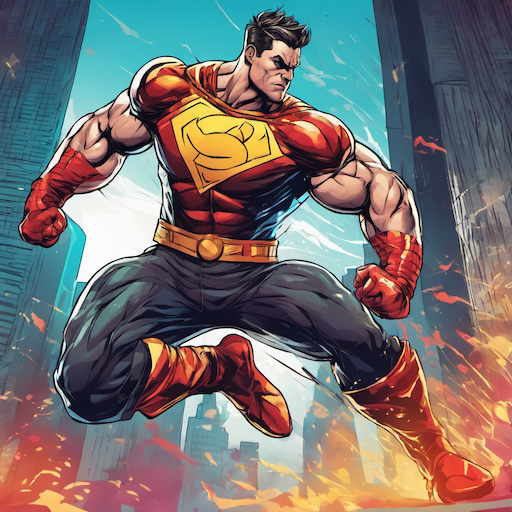
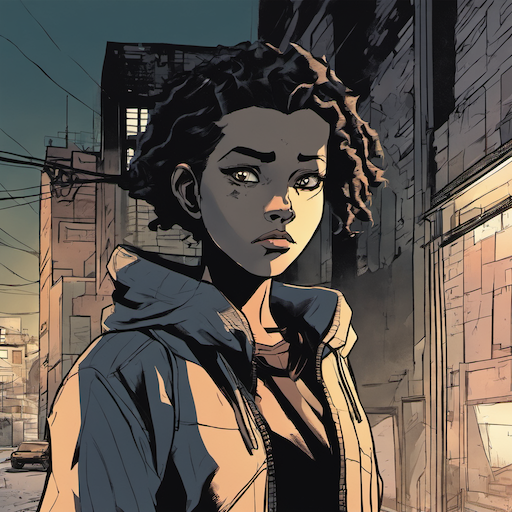
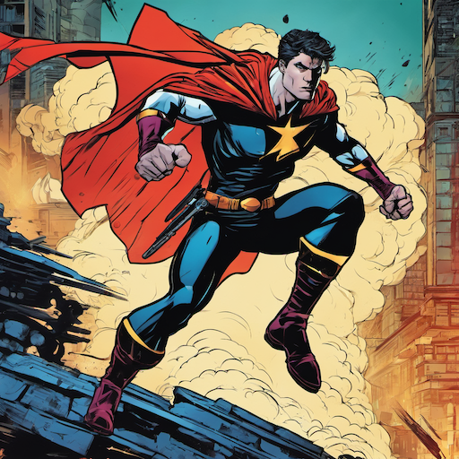
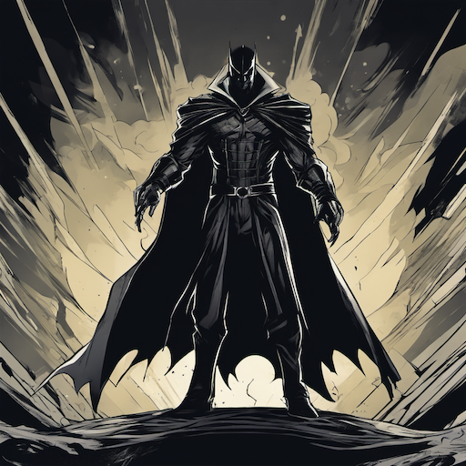
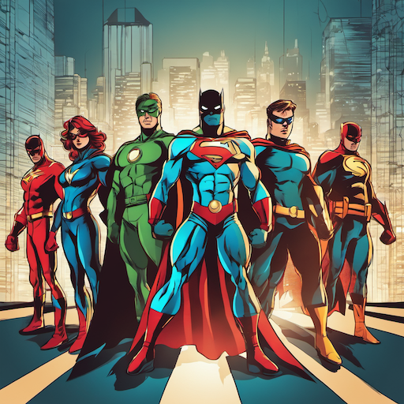
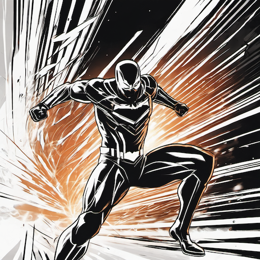
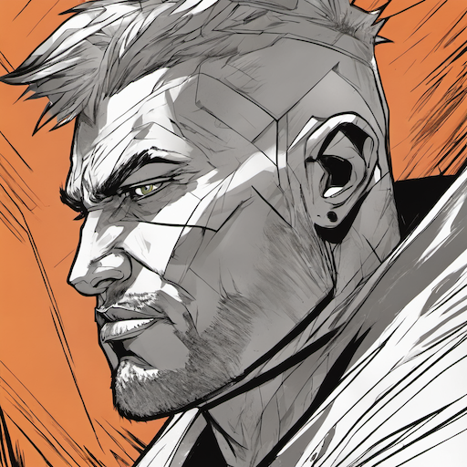
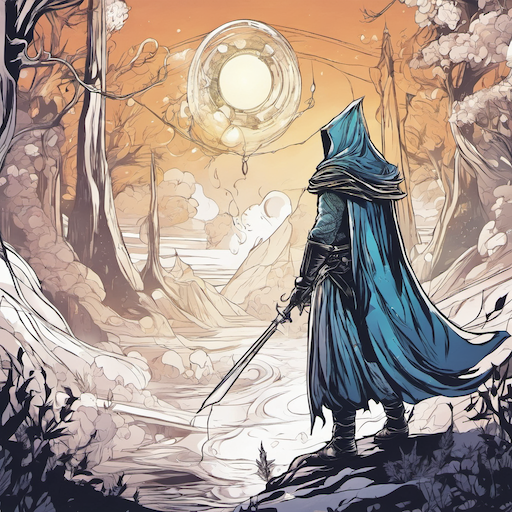
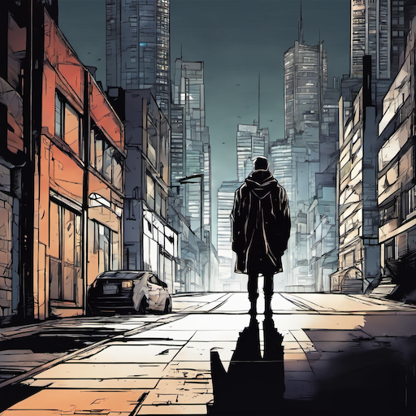
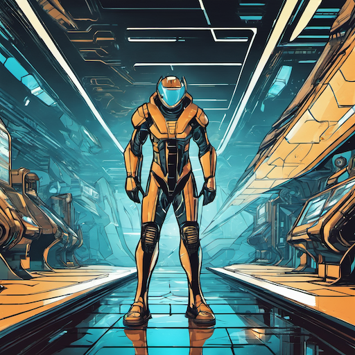

# Comic Book & Graphic Novel Style Prompt Guide

## Core Principles

### 1. **Comic Book Aesthetics**

- Bold, dynamic compositions
- Strong line work and inking
- Vibrant, saturated colors
- Action-oriented poses and scenes
- Clear visual storytelling

### 2. **Graphic Novel Elements**

- Sophisticated storytelling
- Detailed character development
- Complex narratives and themes
- Artistic experimentation
- Literary quality illustrations

### 3. **Style Variations**

- **Superhero Comics**: Dynamic action, bold colors, heroic poses
- **Indie Comics**: Artistic experimentation, unique styles
- **Manga-Influenced**: Anime-style with comic book techniques
- **European Comics**: Detailed backgrounds, sophisticated art

## Essential Prompt Structure

### Base Template

```text
[character/scene], [action/pose], [background], [lighting], [comic style], [quality], [mood/story]
```

### Example

```text
A superhero in dynamic action pose, flying through a cityscape, dramatic lighting with bold shadows, comic book art style with strong line work, high quality, heroic atmosphere
```

## Advanced Techniques

### 1. **Character Design**

- **Heroes**: "muscular build, heroic pose, flowing cape, determined expression"
- **Villains**: "sinister appearance, dark costume, menacing pose, evil expression"
- **Civilians**: "everyday clothing, natural poses, relatable appearance"
- **Creatures**: "fantastical design, unique features, otherworldly appearance"

### 2. **Action and Poses**

- **Dynamic**: "action pose, dynamic movement, flying pose, fighting stance"
- **Static**: "standing pose, dramatic pose, heroic stance, contemplative pose"
- **Emotional**: "expressive face, emotional pose, dramatic expression, character emotion"
- **Group**: "team pose, group composition, multiple characters, ensemble shot"

### 3. **Background Elements**

- **Urban**: "cityscape, skyscrapers, street scene, urban environment"
- **Fantasy**: "fantasy world, magical realm, otherworldly landscape, mystical setting"
- **Space**: "cosmic background, stars, planets, space environment"
- **Interior**: "room interior, building interior, indoor scene, architectural setting"

### 4. **Artistic Techniques**

- **Line Work**: "strong line work, bold inking, clean lines, detailed line art"
- **Coloring**: "bold colors, vibrant palette, comic book colors, flat coloring"
- **Shading**: "cell shading, comic book shadows, bold shadows, dramatic lighting"
- **Effects**: "action lines, speed lines, impact effects, comic book effects"

## Style-Specific Modifiers

### Comic Book Quality Enhancers

```text
comic book art, graphic novel art, comic illustration, superhero art, comic book style, graphic novel style, comic book illustration, professional comic art
```

### Artist References

```text
Jack Kirby style, Frank Miller style, Alex Ross style, Jim Lee style, Todd McFarlane style, Art Spiegelman style
```

## Negative Prompts

### Essential Comic Book Negatives

```text
realistic, photorealistic, 3d render, CGI, low quality, blurry, pixelated, deformed, bad anatomy, extra limbs, missing fingers, fused body parts, bad proportions, poorly drawn face, bad hands, bad eyes, ugly, mutated, extra limbs, missing fingers, fused body parts, bad proportions, poorly drawn face, bad hands, bad eyes
```

### Advanced Negatives

```text
anime style, manga style, realistic proportions, photographic, live action, movie still, screenshot, video game render
```

## Sample Prompts by Category

### Superhero Action Scene

```text
A muscular superhero in dynamic flying pose, wearing a colorful costume with flowing cape, dramatic cityscape background, bold comic book lighting, comic book art style with strong line work, high quality, heroic action scene
```

### Graphic Novel Character

```text
A complex character with detailed facial expression, wearing everyday clothing, standing in a moody urban environment, dramatic lighting with strong shadows, graphic novel art style, highly detailed, emotional storytelling
```

### Comic Book Cover

```text
A dramatic comic book cover with a hero in iconic pose, bold background with action elements, vibrant comic book colors, strong line work and inking, comic book cover art style, high quality, epic atmosphere
```

## 10 Example Prompts

### 1. Superhero Battle

```text
A muscular superhero in dynamic fighting pose, wearing a colorful costume, dramatic cityscape background, bold comic book lighting, comic book art style with strong line work, high quality, intense action scene
```



### 2. Graphic Novel Scene

```text
A complex character with detailed facial expression, standing in a moody urban environment, dramatic lighting with strong shadows, graphic novel art style, highly detailed, emotional storytelling
```



### 3. Comic Book Cover

```text
A dramatic comic book cover with a hero in iconic pose, bold background with action elements, vibrant comic book colors, strong line work and inking, comic book cover art style, high quality, epic atmosphere
```



### 4. Villain Introduction

```text
A sinister villain with dark costume and menacing pose, standing in a dramatic environment, bold shadows and lighting, comic book art style with strong line work, high quality, ominous atmosphere
```



### 5. Team Shot

```text
A group of superheroes in dynamic poses, standing together against a dramatic background, bold comic book lighting, comic book art style with strong line work, high quality, heroic team atmosphere
```



### 6. Action Sequence

```text
A superhero in mid-action pose with speed lines and energy effects, dynamic background, bold comic book lighting, comic book art style with strong line work, high quality, intense action scene
```



### 7. Character Portrait

```text
A detailed character portrait with expressive face and dramatic lighting, strong line work and bold colors, comic book art style, high quality, character study
```



### 8. Fantasy Scene

```text
A fantasy character in magical environment, with mystical elements and dramatic lighting, comic book art style with strong line work, high quality, magical atmosphere
```



### 9. Urban Scene

```text
A character in urban environment with cityscape background, dramatic lighting and shadows, comic book art style with strong line work, high quality, urban atmosphere
```



### 10. Sci-Fi Scene

```text
A sci-fi character in futuristic environment, with technological elements and dramatic lighting, comic book art style with strong line work, high quality, futuristic atmosphere
```



## Advanced Tips

### 1. **Storytelling Elements**

- "dramatic moment" for story emphasis
- "character development" for emotional depth
- "narrative scene" for storytelling focus
- "plot point" for story progression

### 2. **Artistic Techniques**

- "bold line work" for strong comic book style
- "cell shading" for traditional comic coloring
- "action lines" for dynamic movement
- "comic book effects" for visual impact

### 3. **Genre Specificity**

- "superhero comic" for action-oriented art
- "indie comic" for artistic experimentation
- "graphic novel" for sophisticated storytelling
- "comic strip" for humorous or daily life scenes

### 4. **Cultural References**

- "Marvel style" for superhero comics
- "DC Comics style" for classic superhero art
- "European comic" for sophisticated art
- "underground comic" for alternative styles

## Common Mistakes to Avoid

1. **Mixing styles**: Don't combine comic book with realistic photography terms
2. **Poor line work**: Emphasize strong, bold line work appropriate for comics
3. **Inconsistent coloring**: Use comic book-appropriate coloring techniques
4. **Missing action**: Include dynamic elements for comic book appeal
5. **Generic backgrounds**: Include specific comic book background elements

Remember: Comic books and graphic novels emphasize visual storytelling, dynamic action, and bold artistic choices. Focus on strong line work, vibrant colors, and clear character expression while maintaining the distinctive comic book aesthetic.
