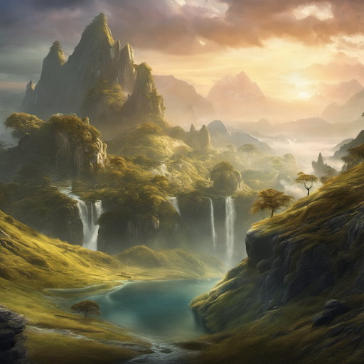

# Concept Art (Character/Environment) Style Prompt Guide

## Core Principles

### 1. **Concept Art Aesthetics**

- Exploratory and iterative designs
- Clear visual communication
- Professional presentation quality
- Industry-standard techniques
- Design-focused approach

### 2. **Concept Art Types**

- **Character Design**: Personality, costume, anatomy studies
- **Environment Design**: World-building, architectural concepts
- **Prop Design**: Weapons, vehicles, objects
- **Creature Design**: Fantasy and sci-fi beings

### 3. **Industry Applications**

- **Film**: Movie concept art and pre-production
- **Games**: Video game development and design
- **Animation**: Character and world development
- **Illustration**: Book covers and editorial work

## Essential Prompt Structure

### Base Template

```text
[subject type], [design purpose], [style/technique], [presentation], [concept art style], [quality], [industry standard]
```

### Example

```text
A fantasy warrior character concept, detailed costume design with multiple views, digital painting technique, professional presentation, concept art style, high quality, industry standard
```

## Advanced Techniques

### 1. **Character Concept Elements**

- **Anatomy**: "anatomy study, figure drawing, character proportions, body structure"
- **Costume**: "costume design, clothing details, armor design, fashion concept"
- **Personality**: "character expression, personality traits, emotional design, character development"
- **Multiple Views**: "front view, side view, back view, three-quarter view, turnaround"

### 2. **Environment Concept Elements**

- **Architecture**: "architectural concept, building design, structural elements, spatial design"
- **Landscape**: "environmental design, landscape concept, terrain features, natural elements"
- **Atmosphere**: "mood lighting, environmental mood, atmospheric effects, world-building"
- **Scale**: "human scale reference, environmental scale, perspective, depth"

### 3. **Presentation Techniques**

- **Professional**: "professional presentation, clean layout, industry standard, portfolio quality"
- **Exploratory**: "design exploration, multiple variations, concept iteration, design process"
- **Detailed**: "high detail, intricate design, fine details, comprehensive concept"
- **Clean**: "clean presentation, minimal background, focused design, clear communication"

### 4. **Design Process**

- **Sketch**: "concept sketch, rough design, initial concept, design exploration"
- **Refined**: "refined concept, detailed design, final concept, polished presentation"
- **Iteration**: "design iteration, multiple versions, concept variation, design evolution"
- **Final**: "final concept, approved design, production ready, final presentation"

## Style-Specific Modifiers

### Concept Art Quality Enhancers

```text
concept art, character design, environment design, concept illustration, professional concept art, industry standard, design concept, concept sketch
```

### Industry References

```text
film concept art, game concept art, animation concept art, illustration concept art, production design, visual development
```

## Negative Prompts

### Essential Concept Art Negatives

```text
finished illustration, final artwork, low quality, blurry, pixelated, deformed, bad anatomy, extra limbs, missing fingers, fused body parts, bad proportions, poorly drawn
```

### Advanced Negatives

```text
amateur art, sketchy, unfinished, rough, messy, unclear, confusing, poorly designed
```

## Sample Prompts by Category

### Character Concept Design

```text
A sci-fi warrior character concept, detailed costume and armor design, multiple views including front and side, digital painting technique, professional presentation, concept art style, high quality, industry standard
```

### Environment Concept Design

```text
A fantasy castle environment concept, architectural design with detailed structures, atmospheric lighting and mood, digital painting technique, professional presentation, concept art style, high quality, world-building design
```

### Creature Concept Design

```text
A fantasy dragon creature concept, detailed anatomy and design, multiple views and poses, digital painting technique, professional presentation, concept art style, high quality, creature design
```

## 10 Example Prompts

### 1. Character Concept Design

```text
A sci-fi warrior character concept, detailed costume and armor design, multiple views including front and side, digital painting technique, professional presentation, concept art style, high quality, industry standard
```


### 2. Environment Concept Design

```text
A fantasy castle environment concept, architectural design with detailed structures, atmospheric lighting and mood, digital painting technique, professional presentation, concept art style, high quality, world-building design
```


### 3. Creature Concept Design

```text
A fantasy dragon creature concept, detailed anatomy and design, multiple views and poses, digital painting technique, professional presentation, concept art style, high quality, creature design
```


### 4. Prop Concept Design

```text
A futuristic weapon concept, detailed design with multiple angles, technical specifications, digital painting technique, professional presentation, concept art style, high quality, prop design
```


### 5. Vehicle Concept Design

```text
A sci-fi vehicle concept, detailed exterior and interior design, multiple views and technical details, digital painting technique, professional presentation, concept art style, high quality, vehicle design
```


### 6. Architecture Concept Design

```text
A futuristic building concept, detailed architectural design with structural elements, atmospheric lighting, digital painting technique, professional presentation, concept art style, high quality, architectural design
```


### 7. Landscape Concept Design

```text
A fantasy landscape concept, detailed environmental design with terrain features, atmospheric lighting and mood, digital painting technique, professional presentation, concept art style, high quality, environmental design
```



### 8. Costume Concept Design

```text
A fantasy costume concept, detailed clothing design with fabric textures, multiple views, digital painting technique, professional presentation, concept art style, high quality, costume design
```


### 9. Weapon Concept Design

```text
A fantasy weapon concept, detailed design with ornate details, multiple angles, digital painting technique, professional presentation, concept art style, high quality, weapon design
```


### 10. Creature Anatomy Concept

```text
A fantasy creature anatomy concept, detailed skeletal and muscular structure, multiple views, digital painting technique, professional presentation, concept art style, high quality, creature anatomy design
```


## Advanced Tips

### 1. **Design Purpose**

- "character design" for personality and appearance
- "environment design" for world-building
- "prop design" for objects and items
- "creature design" for fantasy beings

### 2. **Presentation Quality**

- "professional presentation" for industry standard
- "clean layout" for clear communication
- "portfolio quality" for showcase work
- "production ready" for final concepts

### 3. **Design Process**

- "concept sketch" for initial ideas
- "design exploration" for multiple variations
- "refined concept" for detailed development
- "final concept" for approved design

### 4. **Industry Specificity**

- "film concept art" for movie industry
- "game concept art" for video game industry
- "animation concept art" for animation industry
- "illustration concept art" for publishing industry

## Common Mistakes to Avoid

1. **Finished artwork**: Avoid terms that suggest final illustrations
2. **Poor presentation**: Emphasize professional and clean presentation
3. **Incomplete design**: Include comprehensive design elements
4. **Unclear purpose**: Specify design purpose and application
5. **Missing quality**: Maintain industry-standard quality throughout

Remember: Concept art emphasizes design exploration, clear communication, and professional presentation. Focus on design purpose, presentation quality, and industry standards while maintaining the distinctive concept art aesthetic.
