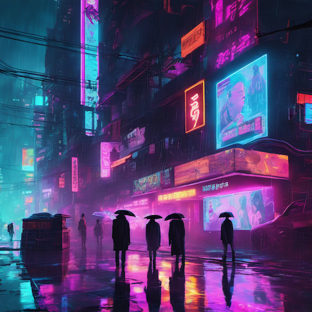
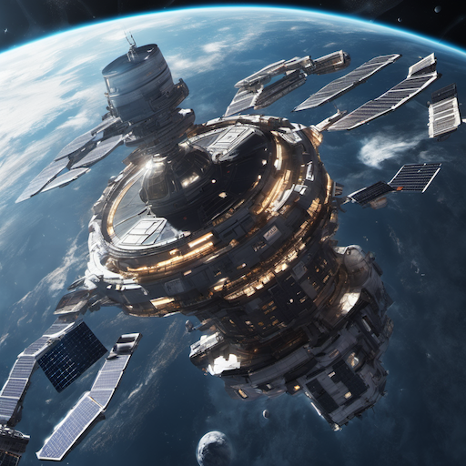
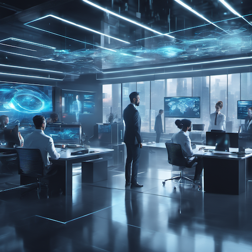
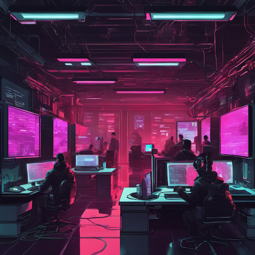
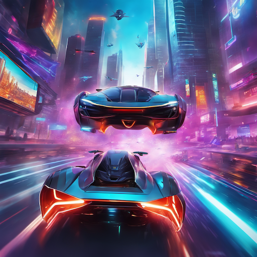
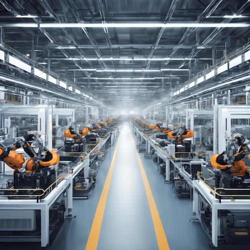
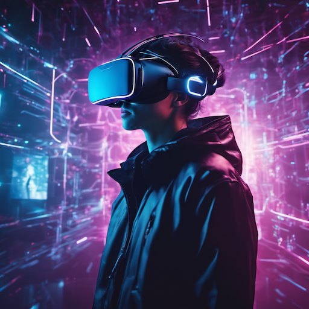
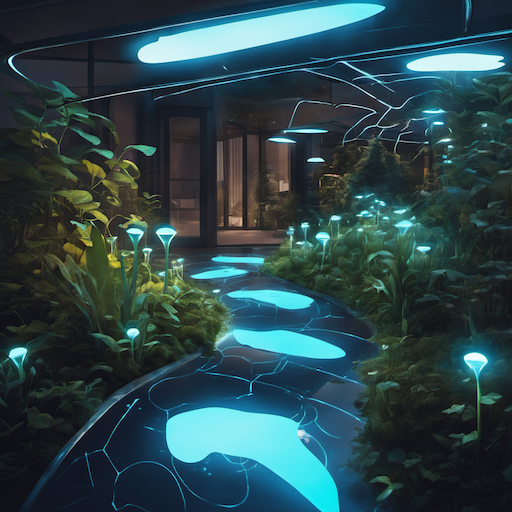

# Cyberpunk & Futuristic Style Prompt Guide

## Core Principles

### 1. **Cyberpunk Aesthetics**

- Neon-lit urban environments
- High-tech, low-life atmosphere
- Corporate dystopia themes
- Human-machine integration
- Glitch and digital artifacts

### 2. **Futuristic Elements**

- Advanced technology and AI
- Space exploration and colonies
- Transhumanism and augmentation
- Clean, minimalist design
- Sustainable and eco-friendly tech

### 3. **Visual Style Variations**

- **Classic Cyberpunk**: Blade Runner, Neuromancer aesthetic
- **Neo-Cyberpunk**: Modern interpretation with current tech
- **Solarpunk**: Optimistic, green future
- **Tech-Noir**: Dark, atmospheric sci-fi

## Essential Prompt Structure

### Base Template

```text
[subject/scene], [action/pose], [environment], [lighting], [technology], [cyberpunk style], [quality], [mood/atmosphere]
```

### Example

```text
A cyberpunk street samurai with neon-lit cybernetic implants, walking through a rain-soaked neon-lit street, holographic advertisements everywhere, dramatic neon lighting, cyberpunk art style, highly detailed, dystopian atmosphere
```

## Advanced Techniques

### 1. **Character Descriptions**

- **Cyberpunk**: "cybernetically enhanced, neon-lit implants, holographic tattoos, augmented reality visor"
- **Corporate**: "pristine business suit, neural interface, holographic displays, corporate logo"
- **Street**: "worn leather jacket, visible cybernetics, street-smart attitude, neon accessories"
- **Hacker**: "data gloves, neural jack, holographic screens, underground aesthetic"

### 2. **Environment Elements**

- **Cityscapes**: "mega-city, towering skyscrapers, flying cars, neon-lit streets"
- **Interiors**: "high-tech laboratory, corporate office, underground club, hacker den"
- **Spaces**: "space station, lunar colony, orbital habitat, interstellar ship"
- **Nature**: "cyberpunk forest, neon-lit gardens, artificial ecosystems, terraformed landscapes"

### 3. **Technology Features**

- **Holograms**: "holographic displays, floating screens, projected interfaces, light-based technology"
- **Cybernetics**: "mechanical limbs, neural implants, cybernetic eyes, augmented reality"
- **AI**: "artificial intelligence, robotic assistants, autonomous systems, smart technology"
- **Transport**: "flying vehicles, magnetic levitation, teleportation devices, space travel"

### 4. **Lighting and Effects**

- **Neon**: "neon lighting, colorful glow, electric blue, hot pink, vibrant purples"
- **Digital**: "digital artifacts, glitch effects, pixelated elements, data streams"
- **Atmospheric**: "rain, fog, smoke, steam, industrial pollution"
- **Natural**: "artificial sunlight, LED lighting, bioluminescent elements, sustainable energy"

## Style-Specific Modifiers

### Cyberpunk Quality Enhancers

```text
cyberpunk art, futuristic art, sci-fi art, high-tech art, digital art, neon art, cyberpunk illustration, futuristic concept art, dystopian art
```

### Artist References

```text
Syd Mead style, Moebius style, H.R. Giger style, Ralph McQuarrie style, Chris Foss style, John Berkey style
```

## Negative Prompts

### Essential Cyberpunk Negatives

```text
medieval, fantasy, historical, ancient, traditional, rustic, natural, organic, low-tech, primitive, low quality, blurry, pixelated, deformed, bad anatomy, extra limbs, missing fingers, fused body parts, bad proportions, poorly drawn
```

### Advanced Negatives

```text
pastel colors, soft lighting, vintage, retro, old-fashioned, traditional architecture, natural materials, wooden structures, historical clothing
```

## Sample Prompts by Category

### Classic Cyberpunk Character

```text
A cyberpunk street samurai with chrome cybernetic arm and neon-lit visor, wearing a leather jacket with holographic patches, standing in a neon-lit alley, rain falling, dramatic neon lighting, cyberpunk art style, highly detailed, dystopian atmosphere
```

### Futuristic Cityscape

```text
A mega-city with towering glass skyscrapers and flying cars, neon-lit streets and holographic advertisements, dramatic sunset with neon glow, futuristic cityscape art, highly detailed, high-tech atmosphere
```

### Space Colony Scene

```text
A futuristic space colony with domed habitats and solar panels, astronauts in advanced suits, Earth visible in the background, clean minimalist lighting, sci-fi art style, highly detailed, optimistic future atmosphere
```

## 10 Example Prompts

### 1. Cyberpunk Street Scene

```text
A rain-soaked neon-lit street with holographic advertisements, cyberpunk characters walking past, dramatic neon lighting, cyberpunk art style, highly detailed, dystopian urban atmosphere
```



### 2. Futuristic Space Station

```text
A massive space station orbiting Earth, with docking bays and solar panels, astronauts in advanced suits, clean lighting, futuristic space art, highly detailed, sci-fi atmosphere
```



### 3. Corporate Office

```text
A high-tech corporate office with holographic displays and neural interfaces, business people in futuristic suits, clean lighting, cyberpunk corporate art, highly detailed, professional atmosphere
```



### 4. Underground Hacker Den

```text
A hidden hacker den with multiple screens and data streams, cyberpunk hackers with neural implants, dim lighting, cyberpunk underground art, highly detailed, secretive atmosphere
```



### 5. Flying Car Chase

```text
A high-speed chase between flying cars through a mega-city, neon lights and holographic billboards, dynamic lighting, futuristic action art, highly detailed, adrenaline atmosphere
```



### 6. Robot Factory

```text
A massive automated factory with robotic workers and assembly lines, industrial lighting, futuristic manufacturing art, highly detailed, industrial atmosphere
```



### 7. Virtual Reality Scene

```text
A person immersed in virtual reality with neural interface, digital world surrounding them, ethereal lighting, cyberpunk VR art, highly detailed, digital atmosphere
```



### 8. Solarpunk Garden

```text
A sustainable futuristic garden with bioluminescent plants and solar technology, eco-friendly design, natural lighting, solarpunk art style, highly detailed, optimistic atmosphere
```



### 9. Cybernetic Enhancement

```text
A person undergoing cybernetic enhancement surgery, medical robots and advanced equipment, clinical lighting, cyberpunk medical art, highly detailed, technological atmosphere
```


### 10. AI Laboratory

```text
A high-tech AI laboratory with artificial intelligence displays and robotic assistants, scientists in futuristic lab coats, bright lighting, futuristic research art, highly detailed, scientific atmosphere
```


## Advanced Tips

### 1. **Technology Integration**

- "neural interface" for brain-computer connections
- "holographic displays" for futuristic screens
- "cybernetic augmentation" for human enhancement
- "artificial intelligence" for AI presence

### 2. **Atmospheric Elements**

- "neon rain" for cyberpunk weather
- "digital fog" for technological atmosphere
- "holographic mist" for futuristic effects
- "electric atmosphere" for high-tech mood

### 3. **Color Palettes**

- **Neon**: "electric blue, hot pink, vibrant purple, neon green"
- **Corporate**: "clean whites, metallic grays, professional blues"
- **Street**: "dark blacks, neon accents, worn browns, street grays"
- **Space**: "deep blacks, star whites, metallic silvers, cosmic blues"

### 4. **Cultural References**

- "Blade Runner style" for classic cyberpunk
- "Ghost in the Shell style" for anime cyberpunk
- "Star Wars style" for space opera
- "The Matrix style" for digital reality

## Common Mistakes to Avoid

1. **Mixing eras**: Don't combine futuristic with historical elements
2. **Poor lighting**: Use neon, digital, or high-tech lighting appropriate for the style
3. **Generic technology**: Include specific futuristic elements and details
4. **Inconsistent style**: Maintain cyberpunk/futuristic aesthetic throughout
5. **Missing atmosphere**: Always include mood and technological atmosphere

Remember: Cyberpunk and futuristic art emphasize technology, innovation, and the relationship between humans and machines. Focus on high-tech elements, neon aesthetics, and forward-thinking design while maintaining visual coherence.
