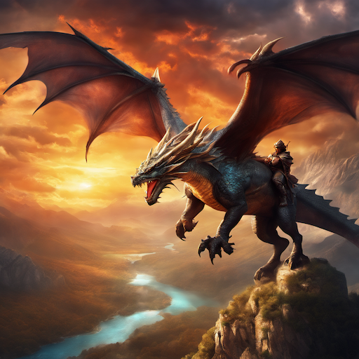
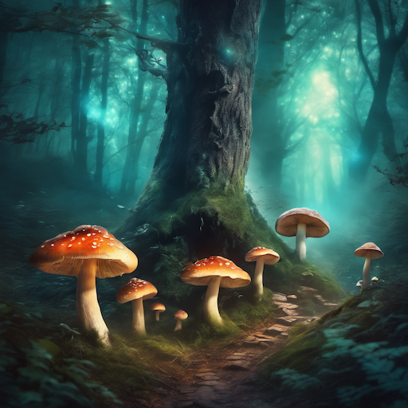
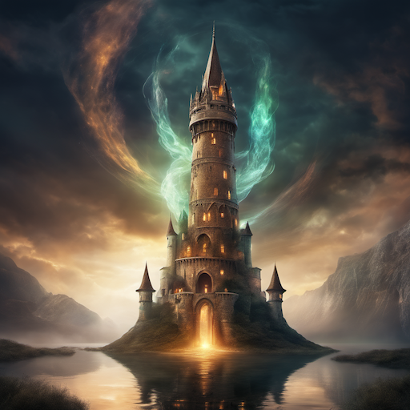
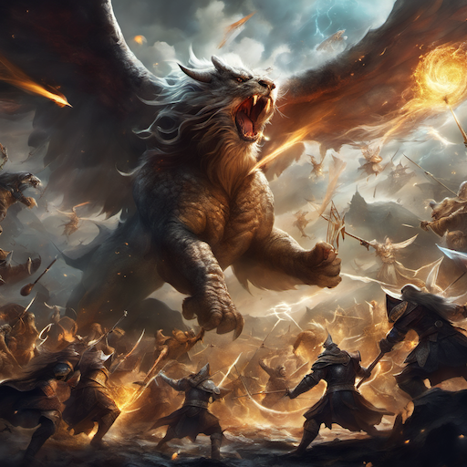
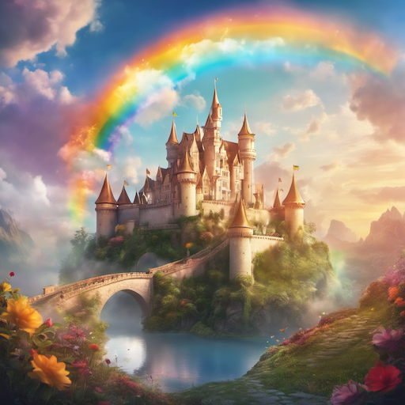
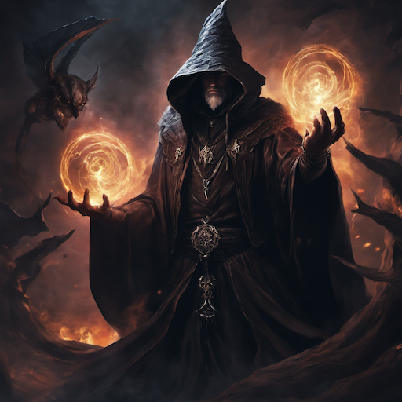
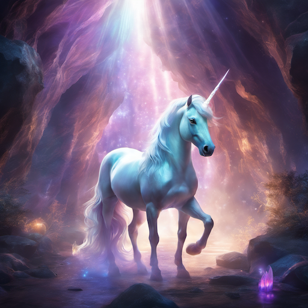
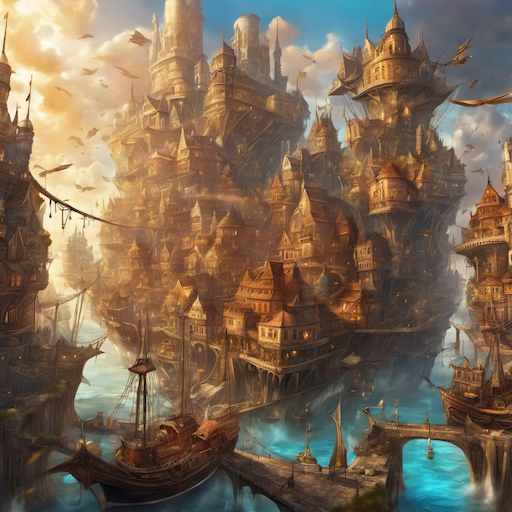
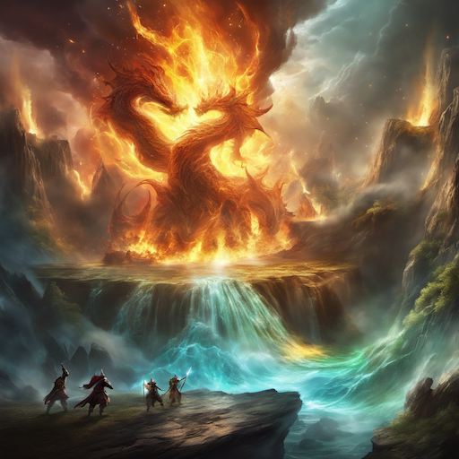
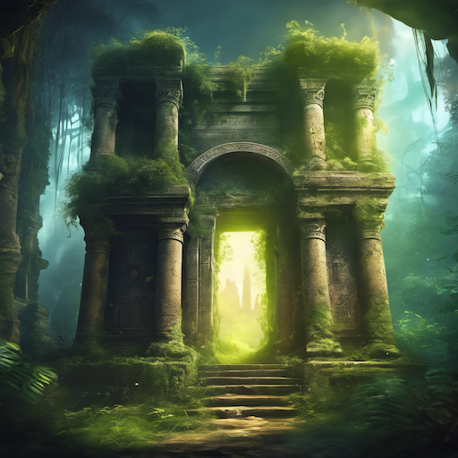

# Fantasy Art Style Prompt Guide

## Core Principles

### 1. **Fantasy Aesthetics**

- Magical and otherworldly elements
- Rich, vibrant color palettes
- Dramatic lighting and atmospheric effects
- Imaginative creatures and environments
- Epic scale and grandeur

### 2. **Fantasy Genres**

- **High Fantasy**: Medieval settings, magic, dragons, epic quests
- **Dark Fantasy**: Grim atmospheres, horror elements, gothic themes
- **Urban Fantasy**: Modern settings with magical elements
- **Science Fantasy**: Blend of sci-fi and fantasy elements

### 3. **Artistic Styles**

- **Classical Fantasy**: Inspired by traditional fantasy illustrators
- **Modern Fantasy**: Contemporary digital art techniques
- **Concept Art**: Detailed world-building and character design
- **Book Cover Style**: Dramatic compositions for literature

## Essential Prompt Structure

### Base Template

```text
[subject/scene], [action/pose], [environment], [lighting], [magical elements], [fantasy style], [quality], [mood/atmosphere]
```

### Example

```text
A majestic dragon perched on a mountain peak, wings spread wide, mystical floating islands in the background, dramatic sunset lighting with magical aurora, high fantasy art style, highly detailed, epic atmosphere
```

## Advanced Techniques

### 1. **Character Descriptions**

- **Heroes**: "noble warrior, flowing cape, ornate armor, determined expression"
- **Mages**: "mystical robes, glowing staff, arcane symbols, ethereal aura"
- **Creatures**: "mythical beast, scales, horns, magical features, otherworldly"
- **Villains**: "dark lord, sinister armor, malevolent aura, imposing presence"

### 2. **Environment Elements**

- **Castles**: "ancient fortress, towering spires, stone walls, magical defenses"
- **Forests**: "enchanted woods, glowing mushrooms, mystical trees, ethereal mist"
- **Mountains**: "floating peaks, crystal formations, magical caves, epic vistas"
- **Cities**: "fantasy metropolis, magical architecture, floating buildings, mystical streets"

### 3. **Magical Effects**

- **Spells**: "arcane energy, magical particles, glowing runes, spell effects"
- **Lighting**: "ethereal glow, magical illumination, otherworldly light, mystical atmosphere"
- **Weather**: "magical storms, aurora borealis, mystical fog, enchanted rain"
- **Elements**: "floating fire, liquid light, solid shadows, living stone"

### 4. **Color Palettes**

- **Warm**: "golden tones, fiery oranges, warm purples, magical amber"
- **Cool**: "ethereal blues, mystical greens, icy whites, magical teals"
- **Dark**: "shadowy blacks, deep purples, ominous reds, mysterious grays"
- **Vibrant**: "saturated colors, magical hues, otherworldly tones, fantasy palette"

## Style-Specific Modifiers

### Fantasy Quality Enhancers

```text
fantasy art, high fantasy, epic fantasy, magical art, mystical illustration, fantasy concept art, detailed fantasy, professional fantasy illustration, otherworldly art
```

### Artist References

```text
Frank Frazetta style, Boris Vallejo style, Larry Elmore style, Todd Lockwood style, Michael Whelan style, Donato Giancola style
```

## Negative Prompts

### Essential Fantasy Negatives

```text
realistic, photorealistic, modern, contemporary, mundane, everyday, boring, simple, low quality, blurry, pixelated, distorted, deformed, bad anatomy, extra limbs, missing fingers, fused body parts, bad proportions, poorly drawn
```

### Advanced Negatives

```text
sci-fi, futuristic, technological, urban, cityscape, modern architecture, contemporary fashion, realistic proportions, photographic
```

## Sample Prompts by Category

### High Fantasy Character

```text
A noble elven warrior with flowing silver hair and glowing blue eyes, wearing ornate golden armor with magical runes, standing on a floating crystal platform, ethereal lighting with magical particles, high fantasy art style, highly detailed, epic hero pose
```

### Dark Fantasy Scene

```text
A dark sorcerer in flowing black robes with glowing red eyes, casting dark magic in a gothic cathedral, dramatic shadows and ominous lighting, dark fantasy art style, highly detailed, sinister atmosphere
```

### Fantasy Landscape

```text
A mystical floating city with crystal spires and magical bridges, surrounded by ethereal clouds and floating islands, golden hour lighting with magical aurora, fantasy landscape art, highly detailed, otherworldly atmosphere
```

## 10 Example Prompts

### 1. Dragon Rider

```text
A brave warrior riding a majestic dragon, soaring over a fantasy landscape, dramatic sunset lighting, high fantasy art style, highly detailed, epic adventure atmosphere
```



### 2. Enchanted Forest

```text
A mystical forest with glowing mushrooms and ethereal mist, magical creatures hidden among ancient trees, soft magical lighting, fantasy landscape art, highly detailed, mysterious atmosphere
```



### 3. Wizard's Tower

```text
A towering wizard's tower with magical energy swirling around it, floating in a mystical realm, dramatic lighting with magical effects, fantasy architecture art, highly detailed, magical atmosphere
```



### 4. Battle Scene

```text
A massive battle between fantasy armies, with magical spells and flying creatures, epic scale composition, dramatic lighting, high fantasy art style, highly detailed, intense action atmosphere
```



### 5. Fairy Tale Castle

```text
A beautiful castle floating on clouds, with rainbow bridges and magical gardens, golden hour lighting, fantasy architecture art, highly detailed, dreamlike atmosphere
```



### 6. Dark Sorcerer

```text
A powerful dark sorcerer casting forbidden magic, surrounded by dark energy and shadowy creatures, ominous lighting, dark fantasy art style, highly detailed, sinister atmosphere
```



### 7. Mythical Beast

```text
A majestic unicorn with glowing horn and ethereal mane, standing in a crystal cave, magical lighting, fantasy creature art, highly detailed, mystical atmosphere
```



### 8. Fantasy City

```text
A sprawling fantasy city with flying ships and magical architecture, bustling with magical creatures, warm lighting, fantasy urban art, highly detailed, vibrant atmosphere
```



### 9. Elemental Battle

```text
A battle between elemental beings, fire, water, earth, and air clashing in spectacular fashion, dynamic lighting, fantasy action art, highly detailed, elemental atmosphere
```



### 10. Ancient Ruins

```text
Mysterious ancient ruins with magical inscriptions and glowing artifacts, overgrown with mystical plants, atmospheric lighting, fantasy exploration art, highly detailed, mysterious atmosphere
```



## Advanced Tips

### 1. **World-Building Elements**

- "ancient ruins" for historical depth
- "magical artifacts" for story elements
- "mythical creatures" for fantasy fauna
- "enchanted items" for magical objects

### 2. **Atmospheric Effects**

- "ethereal mist" for mystical atmosphere
- "magical particles" for spell effects
- "otherworldly glow" for supernatural lighting
- "mystical aura" for magical presence

### 3. **Scale and Perspective**

- "epic scale" for grand scenes
- "dramatic perspective" for dynamic angles
- "towering heights" for impressive structures
- "vast landscapes" for expansive views

### 4. **Cultural References**

- "medieval fantasy" for traditional settings
- "nordic fantasy" for viking-inspired themes
- "celtic fantasy" for Irish/Scottish mythology
- "oriental fantasy" for Asian-inspired elements

## Common Mistakes to Avoid

1. **Mixing genres**: Don't combine fantasy with realistic or sci-fi elements
2. **Poor lighting**: Use magical or dramatic lighting appropriate for fantasy
3. **Generic descriptions**: Include specific fantasy elements and details
4. **Inconsistent style**: Maintain fantasy aesthetic throughout the prompt
5. **Missing atmosphere**: Always include mood and atmospheric elements

Remember: Fantasy art thrives on imagination and otherworldly elements. Focus on magical, mystical, and epic qualities while maintaining visual coherence and artistic quality.
