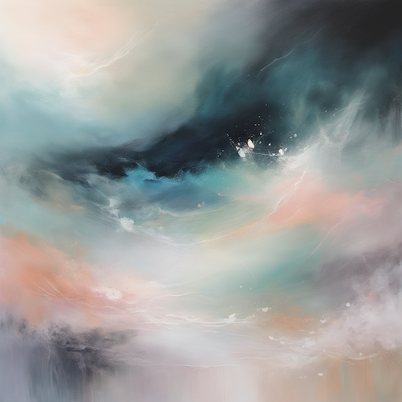

# Horror & Macabre Style Prompt Guide

## Core Principles

- **Dark Atmosphere**: Low lighting, shadows, oppressive environments
- **Psychological Tension**: Unsettling compositions, distorted perspectives
- **Macabre Elements**: Death, decay, supernatural, grotesque imagery
- **Emotional Impact**: Fear, dread, unease, horror
- **Subtle Horror**: Implied rather than explicit violence

## Essential Prompt Structure

```
[subject], [horror elements], [lighting], [atmosphere], [mood], [artistic style], [technical quality]
```

## Advanced Techniques

### Lighting and Shadows

- **Low Key Lighting**: "dim lighting", "shadowy", "dark corners"
- **Dramatic Shadows**: "harsh shadows", "chiaroscuro", "backlighting"
- **Colored Lighting**: "red lighting", "green tint", "blue shadows"
- **Flickering Light**: "candlelight", "flickering", "unstable lighting"

### Atmospheric Effects

- **Fog and Mist**: "thick fog", "misty", "hazy atmosphere"
- **Dust and Particles**: "dust motes", "floating particles", "smoke"
- **Weather Effects**: "stormy", "rain", "lightning", "wind"
- **Environmental Decay**: "mold", "rot", "decay", "deterioration"

### Color Palettes

- **Monochrome**: "black and white", "grayscale", "monochromatic"
- **Desaturated**: "muted colors", "washed out", "dull tones"
- **High Contrast**: "stark contrast", "dramatic shadows", "bold blacks"
- **Unnatural Colors**: "sickly green", "blood red", "corpse blue"

## Style-Specific Modifiers

### Horror Elements

- "supernatural", "ghostly", "demonic", "cursed"
- "decaying", "rotting", "moldy", "putrid"
- "distorted", "twisted", "warped", "nightmarish"
- "haunted", "possessed", "evil", "malevolent"

### Psychological Horror

- "uncanny", "unsettling", "disturbing", "wrong"
- "paranoid", "claustrophobic", "trapped", "isolated"
- "memory", "flashback", "hallucination", "delusion"
- "psychological", "mental", "cognitive", "cerebral"

### Physical Horror

- "gore", "blood", "wounds", "injuries"
- "corpse", "dead", "lifeless", "decaying"
- "monster", "creature", "abomination", "horror"
- "pain", "suffering", "agony", "torment"

## Negative Prompts

- "bright colors", "cheerful", "happy", "uplifting"
- "clean", "sterile", "perfect", "beautiful"
- "safe", "comfortable", "warm", "inviting"
- "cute", "adorable", "sweet", "gentle"

## Sample Prompts by Category

### Supernatural Horror

1. **Ghostly Apparition**: "ghostly figure, translucent, floating, dark hallway, flickering candlelight, cold atmosphere, horror mood"
2. **Haunted House**: "abandoned mansion, broken windows, cobwebs, dark shadows, creaking floorboards, supernatural presence"
3. **Demonic Entity**: "demonic figure, red eyes, dark aura, ritual circle, candlelight, occult symbols, horror atmosphere"
4. **Possessed Child**: "child with black eyes, unnatural smile, dark room, unsettling atmosphere, supernatural horror"
5. **Cursed Object**: "ancient artifact, dark energy, shadowy room, ominous lighting, supernatural horror"

### Psychological Horror

6. **Distorted Reality**: "distorted room, impossible geometry, warped perspective, unsettling atmosphere, psychological horror"
7. **Paranoid Environment**: "endless corridor, repeating patterns, claustrophobic, trapped feeling, psychological tension"
8. **Memory Flashback**: "fragmented memories, distorted faces, dark atmosphere, psychological horror, unsettling"
9. **Isolation Horror**: "empty house, alone, dark corners, paranoia, psychological horror, unsettling atmosphere"
10. **Mental Breakdown**: "fractured reality, distorted perception, dark mood, psychological horror, unsettling"

## 10 Example Prompts

### 1. Ghostly Apparition

```
A ghostly figure, translucent appearance, floating in a dark hallway, flickering candlelight, cold atmosphere, horror mood, unsettling presence, supernatural horror style, high quality
```



### 2. Haunted House

```
An abandoned mansion with broken windows, cobwebs covering doorways, dark shadows everywhere, creaking floorboards, supernatural presence, horror atmosphere, macabre style, high quality
```


### 3. Demonic Entity

```
A demonic figure with glowing red eyes, dark aura surrounding it, ritual circle on floor, candlelight illumination, occult symbols, horror atmosphere, supernatural horror style, high quality
```


### 4. Possessed Child

```
A child with completely black eyes, unnatural smile, standing in a dark room, unsettling atmosphere, supernatural horror, psychological tension, macabre style, high quality
```


### 5. Cursed Object

```
An ancient artifact emanating dark energy, placed in a shadowy room, ominous lighting, supernatural horror, mysterious atmosphere, macabre style, high quality
```


### 6. Distorted Reality

```
A room with impossible geometry, warped perspective, distorted walls, unsettling atmosphere, psychological horror, mind-bending visuals, horror style, high quality
```


### 7. Paranoid Environment

```
An endless corridor with repeating patterns, claustrophobic space, trapped feeling, psychological tension, paranoid atmosphere, horror style, high quality
```


### 8. Memory Flashback

```
Fragmented memories with distorted faces, dark atmosphere, psychological horror, unsettling imagery, mental distress, horror style, high quality
```


### 9. Isolation Horror

```
An empty house with someone alone, dark corners everywhere, paranoia setting in, psychological horror, unsettling atmosphere, macabre style, high quality
```


### 10. Mental Breakdown

```
A fractured reality with distorted perception, dark mood, psychological horror, unsettling visuals, mental chaos, horror style, high quality
```


## Advanced Tips

- Use subtle horror elements rather than explicit gore
- Create tension through lighting and atmosphere
- Focus on psychological rather than physical horror
- Use color psychology to enhance mood
- Balance horror with artistic quality

## Common Mistakes

- Overdoing gore and violence
- Using cliché horror elements
- Ignoring artistic composition
- Making horror too obvious
- Forgetting psychological depth

## Artist/Style References

- H.R. Giger
- Zdzisław Beksiński
- Francis Bacon
- Edvard Munch
- Gothic horror literature
- German Expressionism
