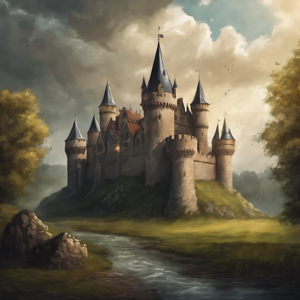
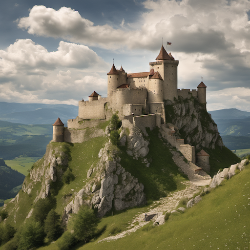
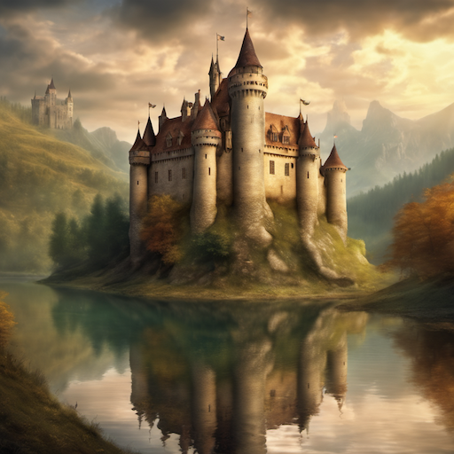
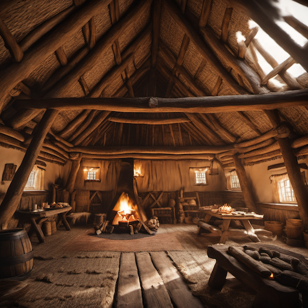
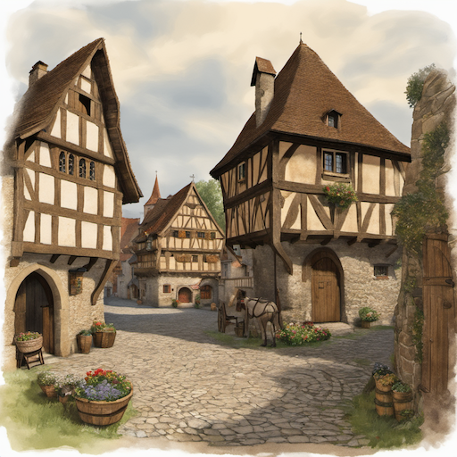
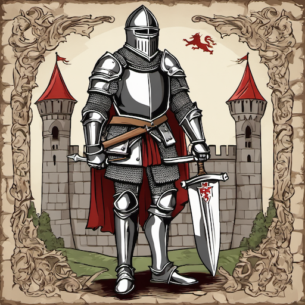
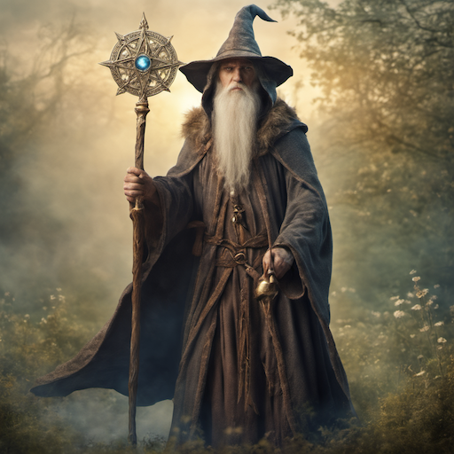
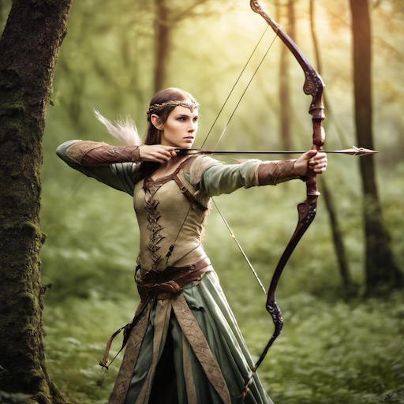
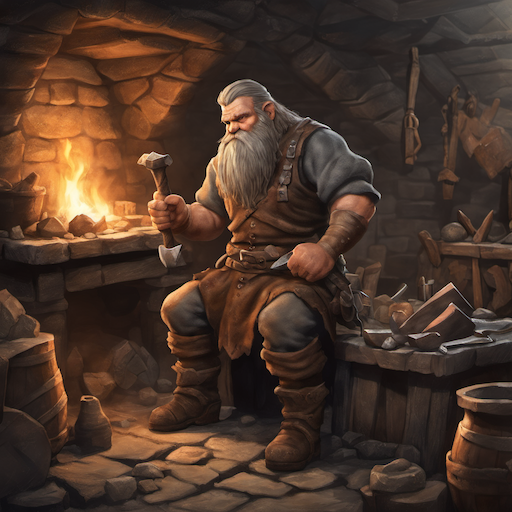
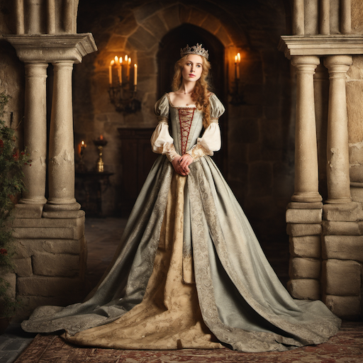

# Medieval & Fantasy Style Prompt Guide

## Core Principles

- **Historical Accuracy**: Authentic medieval architecture, clothing, and technology
- **Fantasy Elements**: Magic, mythical creatures, enchanted environments
- **Medieval Aesthetics**: Stone castles, wooden structures, period-appropriate materials
- **Fantasy Atmosphere**: Mystical lighting, magical effects, otherworldly elements
- **Cultural Authenticity**: Proper medieval social structures, customs, and beliefs

## Essential Prompt Structure

```text
[subject], [medieval/fantasy elements], [materials], [lighting], [atmosphere], [artistic style], [technical quality]
```

## Advanced Techniques

### Medieval Architecture

- **Castles and Fortresses**: "stone castle", "medieval fortress", "battlements", "towers"
- **Religious Buildings**: "gothic cathedral", "medieval church", "monastery", "chapel"
- **Village Structures**: "thatched roofs", "timber framing", "medieval houses", "market square"
- **Defensive Elements**: "moats", "drawbridges", "arrow slits", "fortified walls"

### Fantasy Elements

- **Magical Effects**: "magical aura", "enchanted", "mystical energy", "spell effects"
- **Mythical Creatures**: "dragon", "unicorn", "griffin", "phoenix", "fairy"
- **Enchanted Objects**: "magical sword", "enchanted staff", "crystal ball", "magical artifacts"
- **Fantasy Environments**: "floating islands", "crystal caves", "enchanted forests", "magical realms"

### Period-Appropriate Materials

- **Stone and Masonry**: "stone walls", "masonry", "carved stone", "medieval stonework"
- **Wood and Timber**: "oak beams", "wooden structures", "timber framing", "carved wood"
- **Metal and Iron**: "wrought iron", "steel armor", "iron gates", "metalwork"
- **Textiles and Fabric**: "wool", "linen", "silk", "medieval clothing", "tapestries"

## Style-Specific Modifiers

### Medieval Periods

- **Early Medieval**: "dark ages", "viking", "early medieval", "simple structures"
- **High Medieval**: "gothic", "high medieval", "elaborate architecture", "chivalry"
- **Late Medieval**: "late medieval", "renaissance influence", "advanced technology"
- **Medieval Fantasy**: "medieval fantasy", "magical medieval", "enchanted kingdom"

### Fantasy Races and Cultures

- **Elves**: "elven", "graceful", "magical", "ethereal beauty"
- **Dwarves**: "dwarven", "underground", "stonework", "metalworking"
- **Humans**: "medieval human", "knight", "peasant", "noble"
- **Other Races**: "orc", "goblin", "halfling", "dragonborn"

### Magical Systems

- **Elemental Magic**: "fire magic", "water magic", "earth magic", "air magic"
- **Divine Magic**: "holy magic", "clerical", "divine power", "sacred"
- **Arcane Magic**: "wizardry", "arcane", "spellcasting", "magical energy"
- **Nature Magic**: "druidic", "natural magic", "wild magic", "primal"

## Negative Prompts

```text
modern, contemporary, futuristic, high technology, industrial, steam-powered, electric, digital, clean, minimalist, sleek, modern design, bright neon, LED, electronic, synthetic materials
```

## Sample Prompts by Category

### Medieval Castles and Fortresses

1. **Gothic Castle**: "medieval gothic castle, stone towers, battlements, moat, dramatic lighting, fantasy atmosphere"
2. **Mountain Fortress**: "medieval mountain fortress, stone walls, high towers, rugged terrain, dramatic sky"
3. **Enchanted Castle**: "enchanted medieval castle, magical aura, floating towers, mystical lighting, fantasy realm"
4. **Viking Longhouse**: "viking longhouse, wooden structure, thatched roof, medieval interior, fire pit"
5. **Medieval Village**: "medieval village, timber-framed houses, stone church, market square, period atmosphere"

### Fantasy Characters

6. **Medieval Knight**: "medieval knight, steel armor, heraldic symbols, castle background, chivalric pose"
7. **Fantasy Wizard**: "fantasy wizard, magical staff, enchanted robes, mystical aura, spell effects"
8. **Elven Archer**: "elven archer, graceful pose, magical bow, enchanted forest, ethereal beauty"
9. **Dwarven Smith**: "dwarven blacksmith, underground forge, metalworking, stone halls, medieval fantasy"
10. **Medieval Princess**: "medieval princess, elegant dress, castle interior, royal atmosphere, period clothing"

## 10 Example Prompts

### 1. Gothic Castle

```text
A medieval gothic castle with stone towers and battlements, surrounded by a moat, dramatic lighting, fantasy atmosphere, medieval architecture, high quality
```



### 2. Mountain Fortress

```text
A medieval mountain fortress with stone walls and high towers, rugged terrain, dramatic sky, medieval architecture, fortress design, high quality
```



### 3. Enchanted Castle

```text
An enchanted medieval castle with magical aura, floating towers, mystical lighting, fantasy realm, medieval fantasy style, high quality
```



### 4. Viking Longhouse

```text
A viking longhouse with wooden structure and thatched roof, medieval interior with fire pit, historical atmosphere, medieval style, high quality
```



### 5. Medieval Village

```text
A medieval village with timber-framed houses, stone church, market square, period atmosphere, medieval architecture, high quality
```



### 6. Medieval Knight

```text
A medieval knight in steel armor with heraldic symbols, castle background, chivalric pose, medieval fantasy style, high quality
```



### 7. Fantasy Wizard

```text
A fantasy wizard with magical staff and enchanted robes, mystical aura, spell effects, medieval fantasy style, high quality
```



### 8. Elven Archer

```text
An elven archer with graceful pose and magical bow, enchanted forest background, ethereal beauty, medieval fantasy style, high quality
```



### 9. Dwarven Smith

```text
A dwarven blacksmith at underground forge, metalworking scene, stone halls, medieval fantasy atmosphere, high quality
```



### 10. Medieval Princess

```text
A medieval princess in elegant dress, castle interior, royal atmosphere, period clothing, medieval fantasy style, high quality
```



## Advanced Tips

- Research specific medieval periods for historical accuracy
- Balance fantasy elements with medieval authenticity
- Use period-appropriate materials and construction methods
- Consider social hierarchy and cultural context
- Include authentic medieval technology and craftsmanship

## Common Mistakes

- Mixing medieval and modern elements
- Using fantasy elements that don't fit the period
- Ignoring historical accuracy in favor of fantasy
- Making everything too clean or perfect
- Forgetting medieval social structures

## Artist/Style References

- Medieval illuminated manuscripts
- Gothic architecture
- Fantasy book illustrations
- Medieval tapestries
- Historical reenactment photography
- Fantasy art masters
- Medieval art and sculpture
