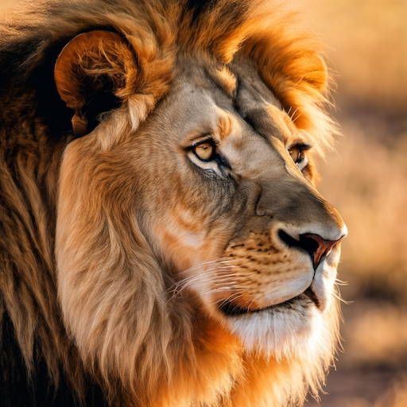
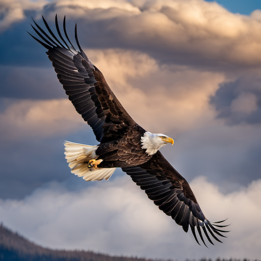
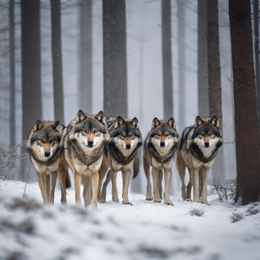
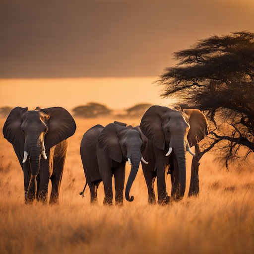
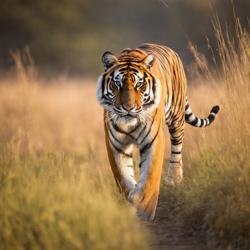
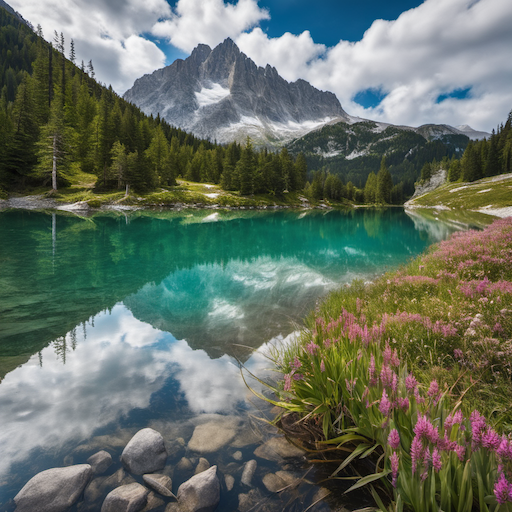
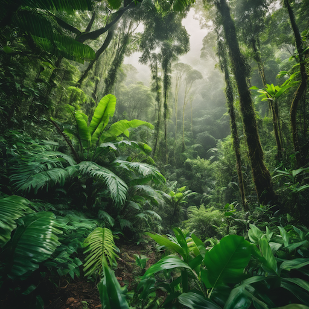
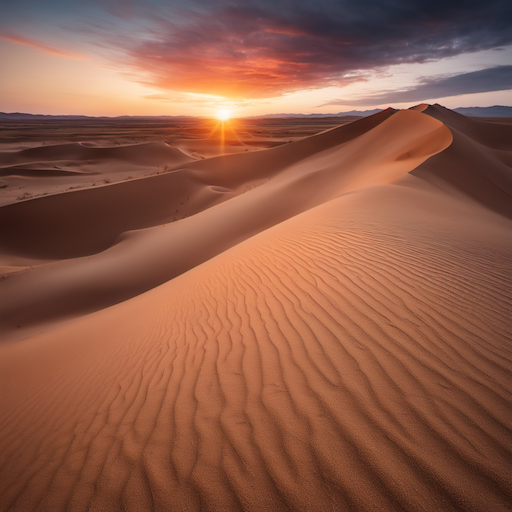
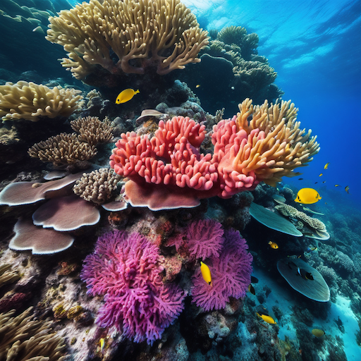
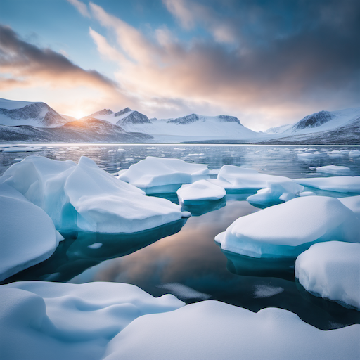

# Nature & Wildlife Style Prompt Guide

## Core Principles

- **Natural Beauty**: Organic forms, authentic wildlife behavior, realistic environments
- **Environmental Accuracy**: Proper habitats, seasonal changes, natural lighting
- **Wildlife Behavior**: Natural poses, authentic animal characteristics, realistic interactions
- **Ecosystem Balance**: Proper relationships between species, environmental harmony
- **Conservation Awareness**: Respectful representation of endangered species and habitats

## Essential Prompt Structure

```text
[subject], [wildlife/nature elements], [environment], [lighting], [season], [artistic style], [technical quality]
```

## Advanced Techniques

### Wildlife Photography Styles

- **Portrait Style**: "close-up", "detailed features", "expressive eyes", "natural pose"
- **Action Shots**: "in motion", "hunting", "flying", "swimming", "running"
- **Environmental**: "in habitat", "natural setting", "ecosystem", "wilderness"
- **Behavioral**: "social interaction", "mating display", "parenting", "feeding"

### Natural Lighting

- **Golden Hour**: "golden light", "sunset", "warm lighting", "dramatic sky"
- **Blue Hour**: "twilight", "blue hour", "soft light", "peaceful atmosphere"
- **Overcast**: "diffused light", "soft shadows", "natural lighting", "cloudy day"
- **Storm Lighting**: "dramatic clouds", "stormy sky", "atmospheric", "moody"

### Seasonal Elements

- **Spring**: "blooming flowers", "new growth", "fresh leaves", "spring colors"
- **Summer**: "lush vegetation", "bright sunlight", "summer heat", "vibrant colors"
- **Autumn**: "fall colors", "changing leaves", "autumn foliage", "golden tones"
- **Winter**: "snow", "frost", "winter landscape", "cold atmosphere"

## Style-Specific Modifiers

### Wildlife Categories

- **Mammals**: "wild mammals", "natural behavior", "authentic pose", "wild habitat"
- **Birds**: "wild birds", "natural flight", "avian behavior", "bird habitat"
- **Marine Life**: "ocean wildlife", "marine environment", "underwater", "aquatic life"
- **Insects**: "insect macro", "detailed features", "natural environment", "wild insects"

### Natural Environments

- **Forest**: "dense forest", "woodland", "trees", "forest floor", "canopy"
- **Savanna**: "grassland", "savanna", "open plains", "grass", "acacia trees"
- **Desert**: "desert landscape", "sand dunes", "cactus", "arid environment"
- **Mountain**: "mountainous", "alpine", "rocky terrain", "high altitude"
- **Ocean**: "marine environment", "coral reef", "open ocean", "coastal"

### Weather and Atmosphere

- **Clear Weather**: "clear sky", "bright sunlight", "natural lighting", "good visibility"
- **Stormy Weather**: "storm clouds", "rain", "lightning", "atmospheric"
- **Foggy**: "misty", "fog", "hazy", "mysterious atmosphere"
- **Windy**: "wind", "moving vegetation", "dynamic", "natural movement"

## Negative Prompts

- "domesticated", "pet", "captive", "zoo"
- "artificial", "man-made", "urban", "city"
- "cartoon", "animated", "fantasy", "mythical"
- "dead", "injured", "sick", "distressed"

## Sample Prompts by Category

### Wildlife Portraits

1. **Lion Portrait**: "majestic lion, close-up portrait, golden mane, amber eyes, natural lighting, african savanna background"
2. **Eagle in Flight**: "bald eagle, soaring through sky, spread wings, dramatic clouds, natural flight, wilderness setting"
3. **Wolf Pack**: "wolf pack, social interaction, natural behavior, forest environment, misty atmosphere, wild wolves"
4. **Elephant Family**: "elephant family, matriarch leading, natural habitat, golden hour lighting, african landscape"
5. **Tiger Hunting**: "bengal tiger, stalking prey, natural hunting behavior, tall grass, dramatic lighting, wild tiger"

### Natural Landscapes

6. **Mountain Lake**: "alpine lake, crystal clear water, mountain peaks, reflection, natural landscape, pristine wilderness"
7. **Tropical Rainforest**: "dense rainforest, lush vegetation, tropical plants, natural lighting, biodiversity, wild nature"
8. **Desert Sunset**: "desert landscape, sand dunes, sunset colors, dramatic sky, natural lighting, arid environment"
9. **Coral Reef**: "vibrant coral reef, marine life, underwater scene, natural colors, ocean environment, biodiversity"
10. **Arctic Tundra**: "arctic landscape, snow-covered, polar environment, natural lighting, pristine wilderness, cold climate"

## 10 Example Prompts

### 1. Lion Portrait

```text
A majestic lion in close-up portrait, golden mane, amber eyes, natural lighting, african savanna background, wildlife photography style, high quality
```



### 2. Eagle in Flight

```text
A bald eagle soaring through sky, spread wings, dramatic clouds, natural flight, wilderness setting, wildlife photography, high quality
```



### 3. Wolf Pack

```text
A wolf pack in social interaction, natural behavior, forest environment, misty atmosphere, wild wolves, wildlife photography style, high quality
```



### 4. Elephant Family

```text
An elephant family with matriarch leading, natural habitat, golden hour lighting, african landscape, wildlife photography, high quality
```



### 5. Tiger Hunting

```text
A bengal tiger stalking prey, natural hunting behavior, tall grass, dramatic lighting, wild tiger, wildlife photography style, high quality
```



### 6. Mountain Lake

```text
An alpine lake with crystal clear water, mountain peaks, reflection, natural landscape, pristine wilderness, nature photography, high quality
```



### 7. Tropical Rainforest

```text
A dense rainforest with lush vegetation, tropical plants, natural lighting, biodiversity, wild nature, nature photography style, high quality
```



### 8. Desert Sunset

```text
A desert landscape with sand dunes, sunset colors, dramatic sky, natural lighting, arid environment, nature photography, high quality
```



### 9. Coral Reef

```text
A vibrant coral reef with marine life, underwater scene, natural colors, ocean environment, biodiversity, nature photography style, high quality
```



### 10. Arctic Tundra

```text
An arctic landscape with snow coverage, polar environment, natural lighting, pristine wilderness, cold climate, nature photography, high quality
```



## Advanced Tips

- Research specific animal behavior and habitats
- Use authentic natural lighting conditions
- Consider seasonal and environmental factors
- Respect wildlife and avoid harmful stereotypes
- Include environmental context for authenticity

## Common Mistakes

- Using domesticated animal poses for wildlife
- Ignoring natural habitat and behavior
- Using artificial or studio lighting
- Forgetting seasonal and environmental context
- Making animals too anthropomorphic

## Artist/Style References

- National Geographic photography
- Wildlife photographers
- Nature documentaries
- Conservation photography
- Natural history illustrations
- Environmental art
- Wildlife art masters
