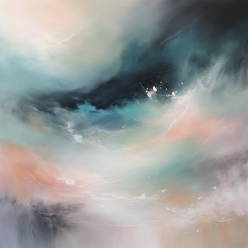

# Sci-Fi & Space Style Prompt Guide

## Core Principles

- **Futuristic Technology**: Advanced machinery, holographic displays, sleek designs
- **Space Environments**: Zero gravity, cosmic phenomena, alien worlds
- **Scientific Accuracy**: Plausible physics, realistic space conditions
- **Advanced Materials**: Metallic surfaces, energy fields, exotic materials
- **Cosmic Scale**: Vast distances, celestial bodies, astronomical phenomena

## Essential Prompt Structure

```
[subject], [sci-fi elements], [technology], [environment], [lighting], [artistic style], [technical quality]
```

## Advanced Techniques

### Space Environments

- **Zero Gravity**: "floating", "weightless", "zero gravity", "microgravity"
- **Cosmic Phenomena**: "nebula", "asteroid field", "solar flares", "cosmic radiation"
- **Celestial Bodies**: "distant planets", "alien moons", "asteroids", "comets"
- **Space Weather**: "solar wind", "cosmic rays", "magnetic fields", "plasma"

### Technology Elements

- **Holographic Displays**: "hologram", "projection", "light field", "virtual interface"
- **Energy Fields**: "force field", "energy barrier", "plasma shield", "magnetic containment"
- **Advanced Materials**: "carbon fiber", "graphene", "metamaterials", "smart materials"
- **Robotic Elements**: "android", "cyborg", "mechanical", "automated"

### Lighting in Space

- **Starlight**: "starlit", "cosmic lighting", "stellar illumination"
- **Artificial Lighting**: "LED lighting", "neon glow", "plasma light"
- **Energy Sources**: "fusion reactor", "quantum light", "energy core"
- **Atmospheric Effects**: "aurora", "energy discharge", "plasma glow"

## Style-Specific Modifiers

### Space Technology

- "spaceship", "space station", "satellite", "probe"
- "warp drive", "hyperdrive", "quantum engine", "fusion reactor"
- "teleporter", "transporter", "beam technology", "quantum teleportation"
- "artificial intelligence", "AI", "neural network", "quantum computer"

### Alien Worlds

- "alien planet", "exoplanet", "distant world", "foreign soil"
- "alien life", "extraterrestrial", "xenobiology", "cosmic life"
- "alien architecture", "xeno-engineering", "foreign technology", "cosmic design"
- "alien landscape", "otherworldly", "cosmic terrain", "stellar geography"

### Scientific Concepts

- "quantum physics", "relativity", "spacetime", "multiverse"
- "dark matter", "dark energy", "black hole", "wormhole"
- "time dilation", "space-time curvature", "gravitational waves", "quantum entanglement"
- "parallel universe", "alternate reality", "dimensional rift", "cosmic anomaly"

## Negative Prompts

- "medieval", "ancient", "primitive", "low technology"
- "earth-like", "terrestrial", "familiar", "ordinary"
- "organic", "natural", "biological", "earthly"
- "simple", "basic", "crude", "primitive"

## Sample Prompts by Category

### Spacecraft and Stations

1. **Advanced Spaceship**: "futuristic spaceship, sleek design, energy engines, holographic controls, cosmic background, sci-fi lighting"
2. **Space Station**: "orbital space station, modular design, solar panels, docking bays, earth view, space environment"
3. **Alien Vessel**: "alien spacecraft, organic technology, bioluminescent, cosmic energy, otherworldly design"
4. **Military Starship**: "battle cruiser, weapon systems, armor plating, tactical displays, space combat scene"
5. **Exploration Ship**: "deep space explorer, scientific equipment, observation deck, stellar navigation, cosmic phenomena"

### Alien Worlds

6. **Crystal Planet**: "alien crystal world, geometric formations, crystalline structures, exotic atmosphere, otherworldly landscape"
7. **Gas Giant**: "massive gas giant, swirling storms, atmospheric bands, orbital rings, cosmic scale"
8. **Ice World**: "frozen alien planet, ice formations, subsurface ocean, geothermal vents, extreme environment"
9. **Desert Planet**: "arid alien world, sand dunes, rock formations, twin suns, harsh climate"
10. **Ocean World**: "water planet, floating cities, underwater structures, alien sea life, aquatic technology"

## 10 Example Prompts

### 1. Advanced Spaceship

```
A futuristic spaceship with sleek design, energy engines, holographic controls, cosmic background, sci-fi lighting, space technology, high quality
```



### 2. Space Station

```
An orbital space station with modular design, solar panels, docking bays, earth view, space environment, sci-fi technology, high quality
```


### 3. Alien Vessel

```
An alien spacecraft with organic technology, bioluminescent features, cosmic energy, otherworldly design, sci-fi art style, high quality
```


### 4. Military Starship

```
A battle cruiser with weapon systems, armor plating, tactical displays, space combat scene, sci-fi military style, high quality
```

### 5. Exploration Ship

```
A deep space explorer with scientific equipment, observation deck, stellar navigation, cosmic phenomena, sci-fi exploration style, high quality
```

### 6. Crystal Planet

```
An alien crystal world with geometric formations, crystalline structures, exotic atmosphere, otherworldly landscape, sci-fi art style, high quality
```

### 7. Gas Giant

```
A massive gas giant with swirling storms, atmospheric bands, orbital rings, cosmic scale, sci-fi space art, high quality
```

### 8. Ice World

```
A frozen alien planet with ice formations, subsurface ocean, geothermal vents, extreme environment, sci-fi landscape style, high quality
```

### 9. Desert Planet

```
An arid alien world with sand dunes, rock formations, twin suns, harsh climate, sci-fi landscape art, high quality
```

### 10. Ocean World

```
A water planet with floating cities, underwater structures, alien sea life, aquatic technology, sci-fi ocean world style, high quality
```

## Advanced Tips

- Research real space phenomena for accuracy
- Consider the physics of space environments
- Balance futuristic elements with plausibility
- Use scale to convey cosmic vastness
- Include scientific concepts for authenticity

## Common Mistakes

- Ignoring physics and scientific accuracy
- Making everything too shiny and perfect
- Forgetting the scale of space
- Using earth-like lighting in space
- Overdoing the futuristic elements

## Artist/Style References

- Syd Mead
- Chris Foss
- Ralph McQuarrie
- H.R. Giger
- Science fiction literature
- NASA photography
- Astronomical imagery
</rewritten_file>
