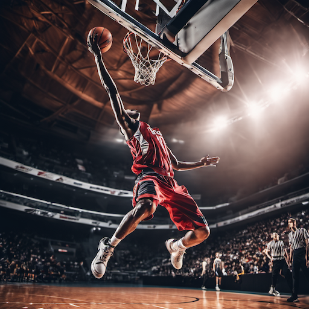
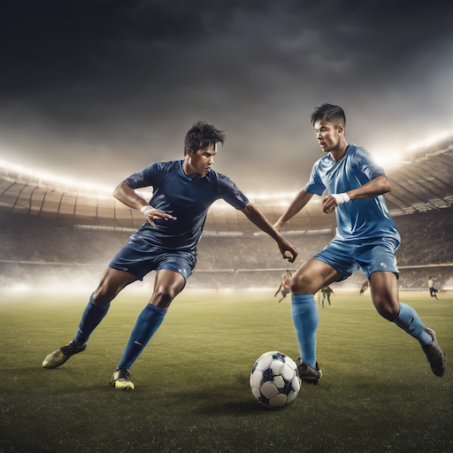
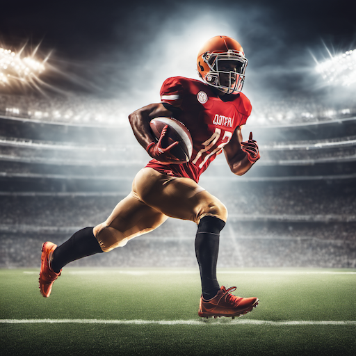
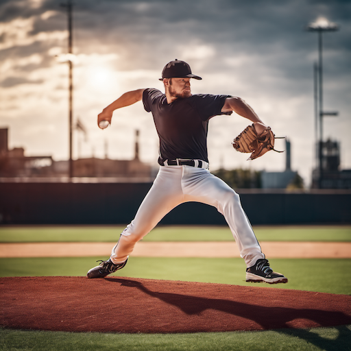
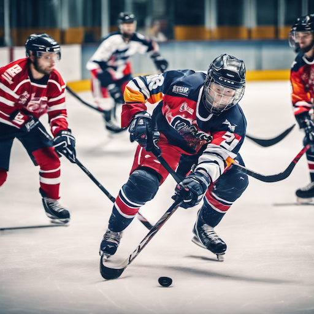
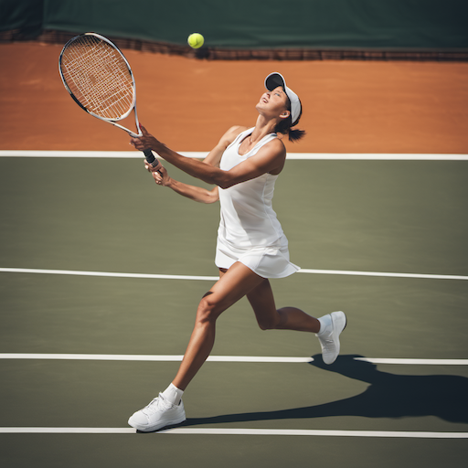
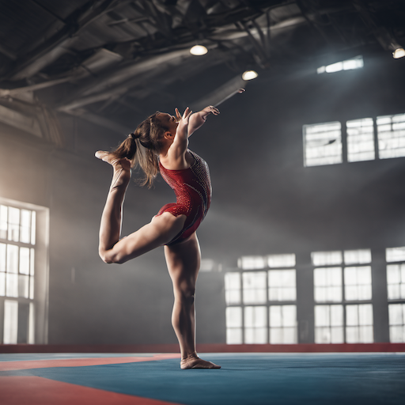
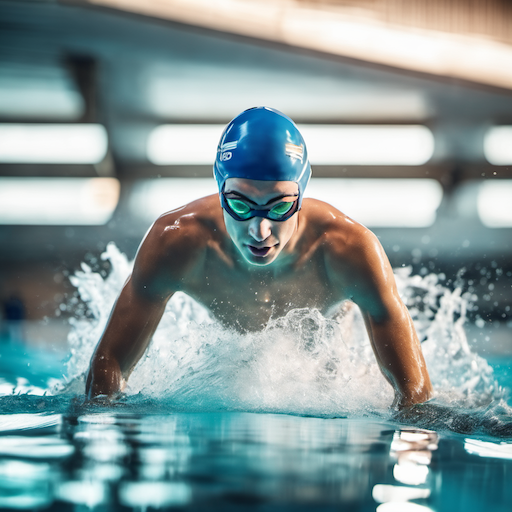
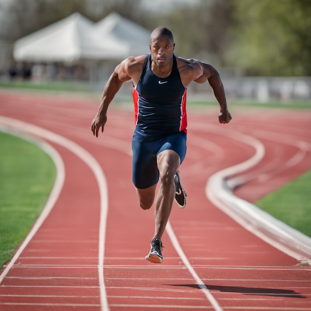
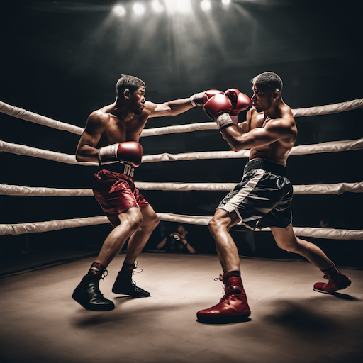

# Sports & Action Style Prompt Guide

## Core Principles

- **Dynamic Movement**: Capturing motion, energy, and athletic performance
- **Authentic Sports**: Real athletic activities, proper techniques, genuine competition
- **Action Photography**: Fast shutter speeds, motion blur, dramatic angles
- **Athletic Excellence**: Peak performance, skill demonstration, competitive spirit
- **Sports Culture**: Team dynamics, fan atmosphere, sporting venues

## Essential Prompt Structure

```text
[subject], [sport/action], [movement], [environment], [lighting], [artistic style], [technical quality]
```

## Advanced Techniques

### Action Photography Styles

- **Freeze Frame**: "frozen action", "peak moment", "decisive moment", "action shot"
- **Motion Blur**: "motion blur", "dynamic movement", "speed lines", "action blur"
- **Panning**: "panning shot", "tracking motion", "blurred background", "moving subject"
- **High Speed**: "high speed photography", "split second", "instant capture", "action freeze"

### Sports Environments

- **Indoor Sports**: "indoor arena", "gymnasium", "sports hall", "indoor lighting"
- **Outdoor Sports**: "outdoor field", "natural lighting", "stadium", "open air"
- **Water Sports**: "aquatic", "underwater", "pool", "ocean sports"
- **Extreme Sports**: "extreme environment", "adventure", "outdoor", "natural setting"

### Athletic Lighting

- **Stadium Lighting**: "stadium lights", "floodlights", "sports lighting", "arena lighting"
- **Natural Light**: "natural lighting", "outdoor sports", "sunlight", "daylight"
- **Dramatic Lighting**: "dramatic shadows", "spotlight", "theatrical", "intense"
- **Action Lighting**: "dynamic lighting", "motion lighting", "sports photography"

## Style-Specific Modifiers

### Sports Categories

- **Team Sports**: "team sport", "group dynamics", "teamwork", "collaboration"
- **Individual Sports**: "individual sport", "personal achievement", "solo performance"
- **Combat Sports**: "combat sport", "martial arts", "fighting", "competition"
- **Extreme Sports**: "extreme sport", "adventure", "risk", "thrill"

### Athletic Movements

- **Running**: "running", "sprinting", "jogging", "athletic movement"
- **Jumping**: "jumping", "leaping", "vertical", "athletic jump"
- **Throwing**: "throwing", "pitching", "passing", "athletic throw"
- **Striking**: "hitting", "kicking", "swinging", "athletic strike"

### Competition Elements

- **Professional**: "professional sport", "elite athlete", "championship", "competition"
- **Amateur**: "amateur sport", "recreational", "casual", "fun"
- **Training**: "training session", "practice", "workout", "preparation"
- **Performance**: "peak performance", "athletic excellence", "skill demonstration"

## Negative Prompts

```text
static, still, motionless, stationary, casual, relaxed, lazy, inactive, artificial, fake, staged, posed, slow, sluggish, weak, unathletic
```

## Sample Prompts by Category

### Team Sports

1. **Basketball Action**: "basketball player, mid-air dunk, dynamic action, indoor arena, dramatic lighting, sports photography"
2. **Soccer Match**: "soccer players, competitive match, outdoor field, natural lighting, team sport, action shot"
3. **Football Play**: "football player, running with ball, stadium lighting, team sport, athletic action, sports moment"
4. **Baseball Pitch**: "baseball pitcher, throwing motion, outdoor stadium, natural lighting, athletic performance"
5. **Hockey Game**: "hockey players, fast action, indoor rink, arena lighting, team sport, dynamic movement"

### Individual Sports

6. **Tennis Serve**: "tennis player, serving motion, outdoor court, natural lighting, individual sport, athletic action"
7. **Gymnastics**: "gymnast, mid-routine, indoor gym, dramatic lighting, athletic performance, dynamic pose"
8. **Swimming**: "swimmer, racing stroke, indoor pool, aquatic lighting, individual sport, water action"
9. **Track Running**: "track runner, sprinting, outdoor track, natural lighting, athletic movement, speed"
10. **Boxing Match**: "boxers, fighting stance, indoor ring, dramatic lighting, combat sport, action shot"

## 10 Example Prompts

### 1. Basketball Action

```text
A basketball player in mid-air dunk, dynamic action, indoor arena, dramatic lighting, sports photography, athletic performance, high quality
```



### 2. Soccer Match

```text
Soccer players in competitive match, outdoor field, natural lighting, team sport, action shot, sports photography style, high quality
```



### 3. Football Play

```text
A football player running with ball, stadium lighting, team sport, athletic action, sports moment, sports photography, high quality
```



### 4. Baseball Pitch

```text
A baseball pitcher in throwing motion, outdoor stadium, natural lighting, athletic performance, sports photography style, high quality
```



### 5. Hockey Game

```text
Hockey players in fast action, indoor rink, arena lighting, team sport, dynamic movement, sports photography, high quality
```



### 6. Tennis Serve

```text
A tennis player in serving motion, outdoor court, natural lighting, individual sport, athletic action, sports photography style, high quality
```



### 7. Gymnastics

```text
A gymnast in mid-routine, indoor gym, dramatic lighting, athletic performance, dynamic pose, sports photography, high quality
```



### 8. Swimming

```text
A swimmer in racing stroke, indoor pool, aquatic lighting, individual sport, water action, sports photography style, high quality
```



### 9. Track Running

```text
A track runner sprinting, outdoor track, natural lighting, athletic movement, speed, sports photography, high quality
```



### 10. Boxing Match

```text
Boxers in fighting stance, indoor ring, dramatic lighting, combat sport, action shot, sports photography style, high quality
```



## Advanced Tips

- Research specific sports techniques and movements
- Use authentic athletic environments and equipment
- Capture genuine moments of competition and performance
- Consider the cultural and social aspects of sports
- Balance action with technical accuracy

## Common Mistakes

- Using unrealistic or impossible athletic poses
- Ignoring proper sports techniques and rules
- Making athletes look weak or unskilled
- Using inappropriate environments for sports
- Forgetting the competitive and social aspects

## Artist/Style References

- Sports photography masters
- Action photography
- Athletic photography
- Sports journalism
- Sports documentaries
- Athletic magazines
- Sports art and illustration
