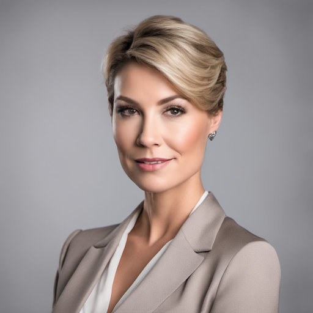
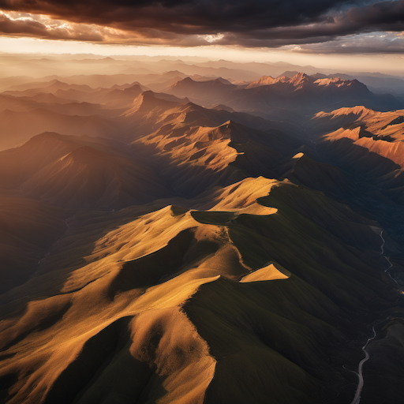
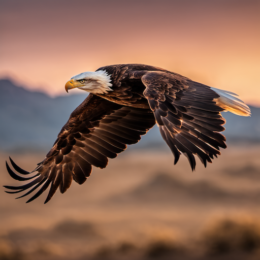
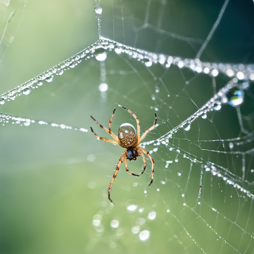
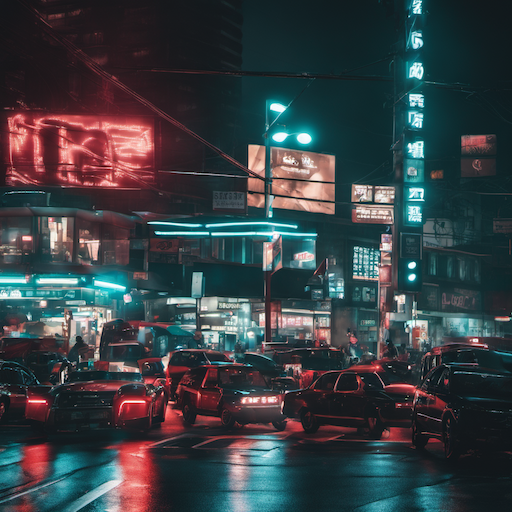
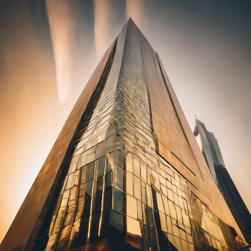
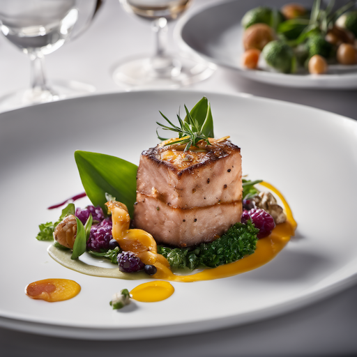
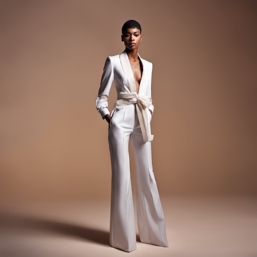
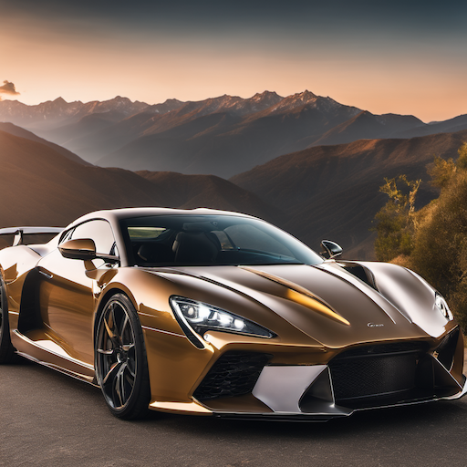

# Stable Diffusion Prompt Guide: Creating Photorealistic & Beautiful Images

## Core Principles

### 1. **Specificity is Key**

- Use precise, descriptive language
- Include specific details about lighting, composition, and style
- Mention exact camera settings and techniques

### 2. **Technical Photography Terms**

- **Camera settings**: "shot on Canon EOS R5, 85mm f/1.4 lens, shallow depth of field"
- **Lighting**: "golden hour lighting, soft natural light, dramatic side lighting"
- **Composition**: "rule of thirds, leading lines, symmetrical composition"
- **Quality**: "8K resolution, highly detailed, professional photography"

### 3. **Style Modifiers**

- **Photorealistic**: "photorealistic, hyperrealistic, ultra-detailed"
- **Professional**: "professional photography, award-winning, National Geographic style"
- **Cinematic**: "cinematic lighting, movie poster style, dramatic atmosphere"

## Essential Prompt Structure

### Base Template

```text
[subject], [action/pose], [lighting], [camera settings], [style], [quality], [composition], [mood/atmosphere]
```

### Example

```text
A majestic lion, standing proudly on a rocky outcrop, golden hour lighting, shot on Canon EOS R5 with 200mm f/2.8 lens, shallow depth of field, photorealistic, 8K resolution, rule of thirds composition, dramatic atmosphere, National Geographic style
```

## Advanced Techniques

### 1. **Lighting Descriptions**

- **Natural**: "soft natural light, diffused sunlight, overcast lighting"
- **Artificial**: "studio lighting, three-point lighting, LED panel illumination"
- **Atmospheric**: "backlighting, rim lighting, volumetric lighting"
- **Time-based**: "golden hour, blue hour, midday sun, sunset glow"

### 2. **Camera and Lens Specifications**

- **Lenses**: "50mm f/1.8, 85mm f/1.4, 200mm f/2.8, wide-angle 24mm"
- **Settings**: "shallow depth of field, bokeh background, long exposure"
- **Techniques**: "macro photography, tilt-shift, HDR, bracketed exposure"

### 3. **Quality Enhancers**

- **Resolution**: "8K, 4K, ultra-high resolution"
- **Detail**: "highly detailed, intricate details, fine textures"
- **Sharpness**: "tack sharp, crisp focus, professional sharpness"

### 4. **Style References**

- **Photographers**: "Ansel Adams style, Steve McCurry style, Peter Lik style"
- **Publications**: "National Geographic, Vogue, Architectural Digest"
- **Art movements**: "impressionist photography, minimalist, documentary style"

## Negative Prompts (What to Avoid)

### Essential Negative Prompts

```text
blurry, low quality, pixelated, distorted, deformed, ugly, bad anatomy, watermark, signature, text, oversaturated, cartoon, anime, painting, drawing, illustration
```

### Advanced Negative Prompts

```text
low resolution, poor lighting, amateur photography, cell phone photo, grainy, noisy, out of focus, motion blur, chromatic aberration, lens flare, vignette
```

## Specialized Categories

### 1. **Portraits**

```text
professional headshot, studio lighting, shallow depth of field, sharp focus on eyes, natural skin texture, professional makeup, high-end fashion photography
```

### 2. **Landscapes**

```text
aerial photography, drone shot, golden hour, dramatic clouds, leading lines, rule of thirds, panoramic view, HDR processing
```

### 3. **Architecture**

```text
architectural photography, clean lines, geometric composition, dramatic shadows, golden hour lighting, wide-angle lens, professional real estate photography
```

### 4. **Nature/Wildlife**

```text
wildlife photography, natural habitat, environmental portrait, telephoto lens, shallow depth of field, National Geographic style, documentary photography
```

## Prompt Engineering Tips

### 1. **Weighting System**

Use parentheses and numbers to emphasize elements:

- `(photorealistic:1.2)` - 20% more emphasis
- `(golden hour lighting:1.5)` - 50% more emphasis
- `(blurry:-1.2)` - 20% less emphasis in negative prompts

### 2. **Sequential Prompting**

Break complex scenes into parts:

```text
"professional studio setup, three-point lighting, (subject), (pose), (expression), (clothing), (background), photorealistic, 8K resolution"
```

### 3. **Reference Images**

- Mention specific styles: "in the style of [photographer]"
- Reference specific techniques: "shot like a [publication] cover"
- Use descriptive comparisons: "as detailed as a [reference]"

## Sample Prompts by Category

### Portrait Photography

```text
A confident businesswoman, professional headshot pose, three-point studio lighting, shot on Canon EOS R5 with 85mm f/1.4 lens, shallow depth of field, sharp focus on eyes, natural skin texture, professional makeup, high-end fashion photography, photorealistic, 8K resolution, award-winning portrait
```

### Landscape Photography

```text
Majestic mountain range at sunset, golden hour lighting, dramatic clouds, aerial drone photography, wide-angle lens, rule of thirds composition, leading lines, HDR processing, National Geographic style, photorealistic, 8K resolution, professional landscape photography
```

### Wildlife Photography

```text
A majestic eagle in flight, natural habitat, environmental portrait, shot on Canon EOS R5 with 400mm f/2.8 lens, shallow depth of field, golden hour backlighting, sharp focus on the bird, National Geographic style, wildlife photography, photorealistic, 8K resolution
```

## 10 Example Prompts

### 1. Portrait Photography

```text
A confident businesswoman, professional headshot pose, three-point studio lighting, shot on Canon EOS R5 with 85mm f/1.4 lens, shallow depth of field, sharp focus on eyes, natural skin texture, professional makeup, high-end fashion photography, photorealistic, 8K resolution, award-winning portrait
```



### 2. Landscape Photography

```text
Majestic range at sunset, golden hour lighting, dramatic clouds, aerial drone photography, wide-angle lens, rule of thirds composition, leading lines, HDR processing, National Geographic style, photorealistic, 8K resolution, professional landscape photography
```



### 3. Wildlife Photography

```text
A majestic eagle in flight, natural habitat, environmentalportrait, shot on Canon EOS R5 with 400mm f/2.8 lens, shallow depth of field, golden hour backlighting, sharp focus on the bird, National Geographic style, wildlife photography, photorealistic, 8K resolution
```



### 4. Macro Photography

```text
A dewdrop on a spider web, macro lens shot, shallow depth of field, natural morning light, shot on Canon EOS R5 with 100mm f/2.8 macro lens, intricate details, National Geographic style, photorealistic, 8K resolution, professional macro photography
```



### 5. Street Photography

```text
A busy urban intersection at night, street photography, neon lights and traffic streaks, shot on Leica Q2 with 28mm f/1.7 lens, cinematic lighting, documentary style, photorealistic, 8K resolution, award-winning street photography
```



### 6. Architectural Photography

```text
A modern glass skyscraper, architectural photography, dramatic perspective, golden hour lighting, shot on Canon EOS R5 with 24-70mm f/2.8 lens, clean lines and geometry, professional real estate photography, photorealistic, 8K resolution
```



### 7. Food Photography

```text
A gourmet dish with artistic plating, food photography, studio lighting setup, shot on Canon EOS R5 with 85mm f/1.4 lens, shallow depth of field, professional food styling, commercial photography, photorealistic, 8K resolution
```



### 8. Fashion Photography

```text
A fashion model in designer clothing, editorial fashion photography, dramatic studio lighting, shot on Canon EOS R5 with 85mm f/1.4 lens, shallow depth of field, Vogue style, professional fashion photography, photorealistic, 8K resolution
```



### 9. Automotive Photography

```text
A luxury sports car on a mountain road, automotive photography, golden hour lighting, dynamic angle, shot on Canon EOS R5 with 24-70mm f/2.8 lens, motion blur background, professional automotive photography, photorealistic, 8K resolution
```



### 10. Abstract Photography

```text
Abstract light patterns and colors, creative photography, experimental lighting, shot on Canon EOS R5 with 50mm f/1.8 lens, artistic composition, fine art photography, photorealistic, 8K resolution, gallery-worthy abstract art
```


## Advanced Tips

### 1. **Iterative Refinement**

- Start with a basic prompt
- Add technical details
- Refine lighting and composition
- Add quality enhancers
- Test and adjust weights

### 2. **Model-Specific Optimization**

- Different models respond differently to certain terms
- Test prompts across multiple models
- Keep a library of successful prompts
- Document what works best for each model

### 3. **Batch Generation**

- Create variations with slight modifications
- Use different lighting scenarios
- Try various camera settings
- Experiment with different styles

## Common Mistakes to Avoid

1. **Too vague**: "beautiful landscape" → "majestic mountain range at golden hour"
2. **Missing technical details**: Add camera settings and lighting
3. **Over-complicating**: Keep prompts focused and coherent
4. **Ignoring negative prompts**: Always include quality control terms
5. **Inconsistent style**: Mixing conflicting artistic styles

## Tools and Resources

### Prompt Generators

- Use AI-powered prompt generators
- Build prompt templates for different categories
- Create prompt libraries for consistent results

### Reference Materials

- Study professional photography
- Analyze award-winning images
- Learn photography terminology
- Understand lighting and composition principles

Remember: The best prompts are specific, technical, and well-structured. Practice and experimentation are key to mastering Stable Diffusion prompt engineering.
