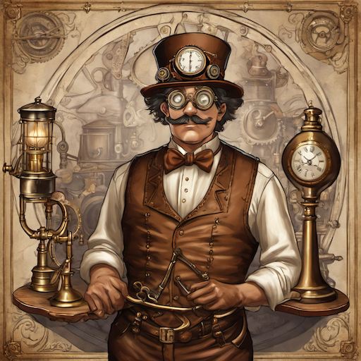
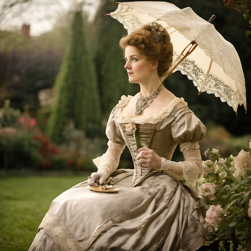
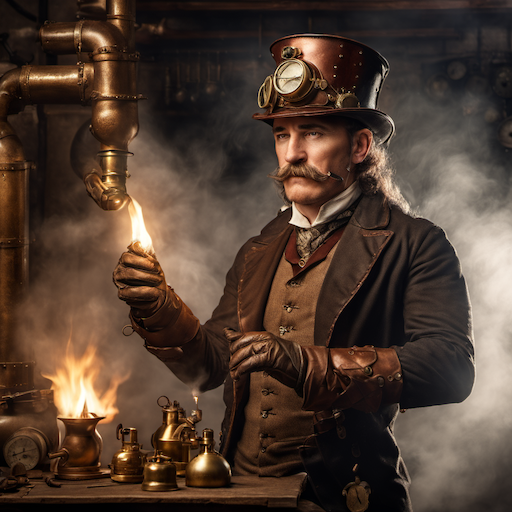
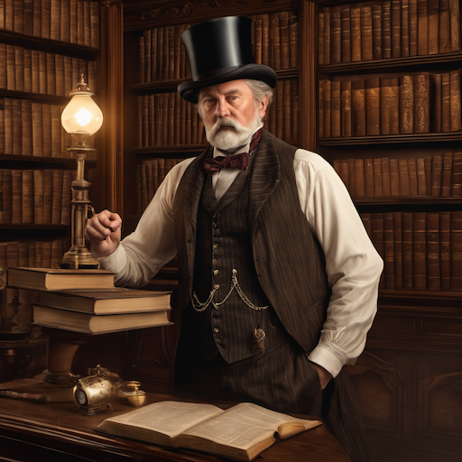
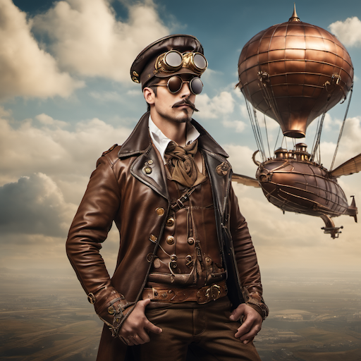
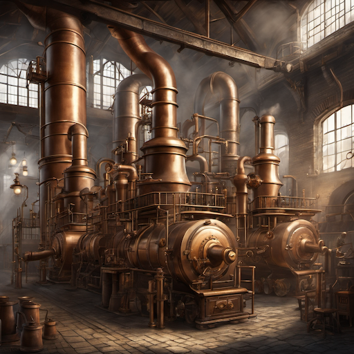
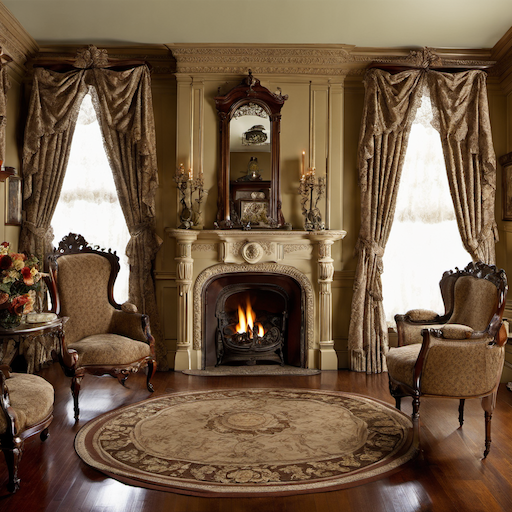
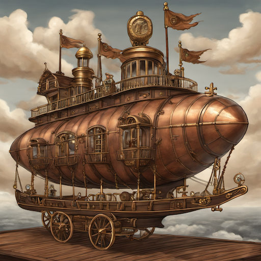
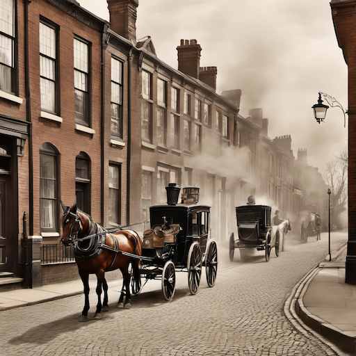
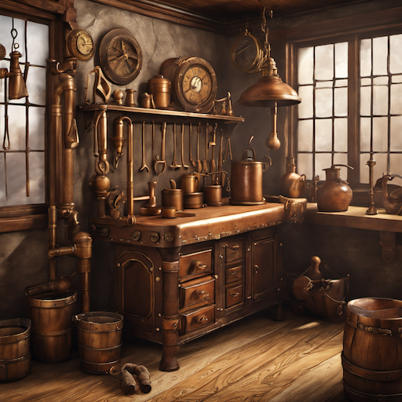

# Steampunk & Victorian Style Prompt Guide

## Core Principles

- **Victorian Aesthetic**: Ornate details, rich textures, elaborate patterns
- **Steampunk Technology**: Brass, copper, gears, steam-powered machinery
- **Industrial Revolution**: Factories, smoke, mechanical complexity
- **Gothic Elements**: Dark atmospheres, dramatic lighting, ornate architecture
- **Historical Accuracy**: Period-appropriate clothing, architecture, and technology

## Essential Prompt Structure

```text
[subject], [steampunk/victorian elements], [materials], [lighting], [atmosphere], [artistic style], [technical quality]
```

## Advanced Techniques

### Material Specification

- **Brass and Copper**: "brass fittings", "copper pipes", "bronze gears"
- **Wood and Leather**: "mahogany wood", "aged leather", "polished oak"
- **Fabric and Textiles**: "silk brocade", "velvet upholstery", "lace trim"
- **Metal and Glass**: "wrought iron", "stained glass", "polished steel"

### Lighting and Atmosphere

- **Gas Lighting**: "gas lamp illumination", "flickering candlelight"
- **Industrial Lighting**: "steam-powered lights", "brass lanterns"
- **Dramatic Shadows**: "chiaroscuro lighting", "deep shadows"
- **Atmospheric Effects**: "steam clouds", "coal smoke", "misty air"

### Architectural Elements

- **Victorian Architecture**: "gothic revival", "queen anne style", "ornate cornices"
- **Industrial Buildings**: "steam-powered factories", "clock towers", "iron bridges"
- **Interior Details**: "wainscoting", "ceiling medallions", "stained glass windows"

## Style-Specific Modifiers

### Steampunk Technology

- "steam-powered", "brass machinery", "copper tubing", "gear mechanisms"
- "clockwork", "mechanical", "automaton", "steam engine"
- "flying machine", "airship", "submarine", "steam locomotive"

### Victorian Fashion

- "corset", "bustle", "top hat", "pocket watch"
- "waistcoat", "cravat", "petticoat", "bonnet"
- "lace gloves", "parasol", "walking stick", "monocle"

### Atmospheric Elements

- "coal smoke", "steam vents", "brass pipes", "copper wires"
- "leather straps", "wooden panels", "iron rivets", "glass gauges"
- "oil lamps", "candlesticks", "gas lighting", "fireplace"

## Negative Prompts

- "modern technology", "digital devices", "plastic", "synthetic materials"
- "minimalist design", "clean lines", "contemporary", "futuristic"
- "bright colors", "neon lights", "LED", "electronic components"

## Sample Prompts by Category

### Character Portraits

1. **Steampunk Inventor**: "portrait of a steampunk inventor, brass goggles, leather apron, copper tools, gas lamp lighting, detailed facial features, victorian workshop background"
2. **Victorian Lady**: "elegant victorian lady, silk dress, lace gloves, parasol, ornate jewelry, soft natural lighting, garden setting"
3. **Steam Engineer**: "steam engineer, brass helmet, copper pipes, leather gloves, workshop environment, dramatic lighting"
4. **Victorian Gentleman**: "distinguished victorian gentleman, top hat, waistcoat, pocket watch, library interior, warm lighting"
5. **Steampunk Aviator**: "steampunk aviator, leather flying cap, brass goggles, copper airship controls, sky background"

### Environments

6. **Steam-Powered Factory**: "steam-powered factory interior, brass machinery, copper pipes, coal smoke, industrial lighting, workers"
7. **Victorian Parlor**: "victorian parlor, ornate furniture, gas lighting, lace curtains, fireplace, elegant atmosphere"
8. **Steampunk Airship**: "steampunk airship deck, brass controls, copper tubing, wooden deck, sky views, steam clouds"
9. **Victorian Street**: "victorian street scene, gas lamps, horse-drawn carriages, brick buildings, cobblestone streets"
10. **Steam Workshop**: "steam workshop, brass tools, copper pipes, leather aprons, wood workbenches, warm lighting"

## 10 Example Prompts

### 1. Steampunk Inventor

```text
A portrait of a steampunk inventor with brass goggles, leather apron, copper tools, gas lamp lighting, detailed facial features, victorian workshop background, steampunk style, high quality
```



### 2. Victorian Lady

```text
An elegant victorian lady in silk dress, lace gloves, parasol, ornate jewelry, soft natural lighting, garden setting, victorian style, high quality
```



### 3. Steam Engineer

```text
A steam engineer with brass helmet, copper pipes, leather gloves, workshop environment, dramatic lighting, steampunk style, high quality
```



### 4. Victorian Gentleman

```text
A distinguished victorian gentleman with top hat, waistcoat, pocket watch, library interior, warm lighting, victorian style, high quality
```



### 5. Steampunk Aviator

```text
A steampunk aviator with leather flying cap, brass goggles, copper airship controls, sky background, steampunk style, high quality
```



### 6. Steam-Powered Factory

```text
A steam-powered factory interior with brass machinery, copper pipes, coal smoke, industrial lighting, workers, steampunk style, high quality
```



### 7. Victorian Parlor

```text
A victorian parlor with ornate furniture, gas lighting, lace curtains, fireplace, elegant atmosphere, victorian style, high quality
```



### 8. Steampunk Airship

```text
A steampunk airship deck with brass controls, copper tubing, wooden deck, sky views, steam clouds, steampunk style, high quality
```



### 9. Victorian Street

```text
A victorian street scene with gas lamps, horse-drawn carriages, brick buildings, cobblestone streets, victorian style, high quality
```



### 10. Steam Workshop

```text
A steam workshop with brass tools, copper pipes, leather aprons, wood workbenches, warm lighting, steampunk style, high quality
```



## Advanced Tips

- Use specific Victorian era references (1837-1901)
- Include period-appropriate materials and textures
- Balance ornate details with functional elements
- Consider social class differences in clothing and environments
- Use atmospheric effects to enhance mood

## Common Mistakes

- Mixing modern elements with period pieces
- Overdoing the brass/copper elements
- Ignoring historical accuracy
- Using bright, modern lighting
- Forgetting period-appropriate proportions

## Artist/Style References

- Jules Verne illustrations
- Victorian photography
- Steampunk literature art
- Industrial Revolution engravings
- Gothic Revival architecture
