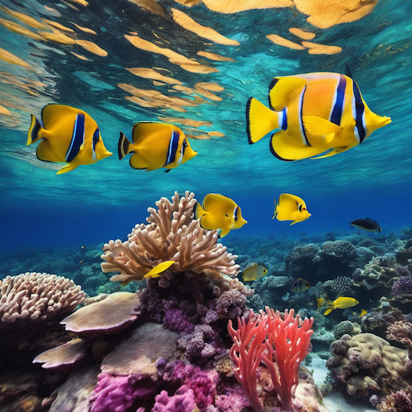
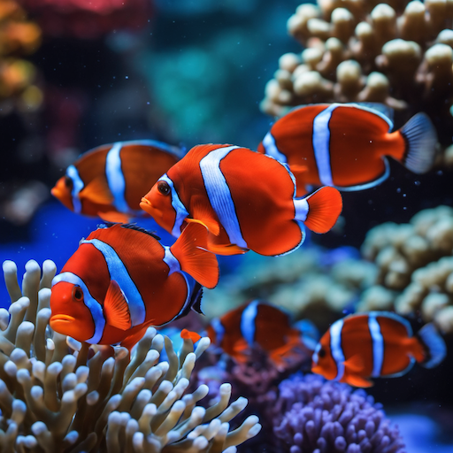
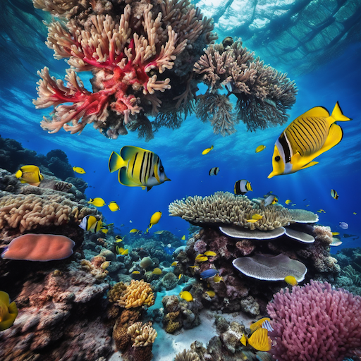
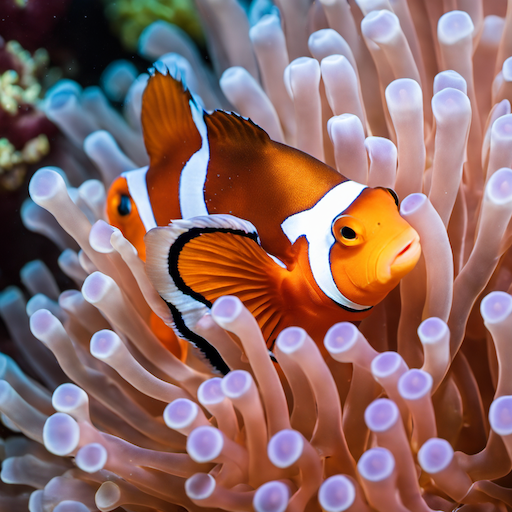
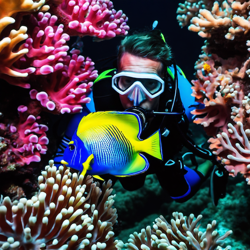
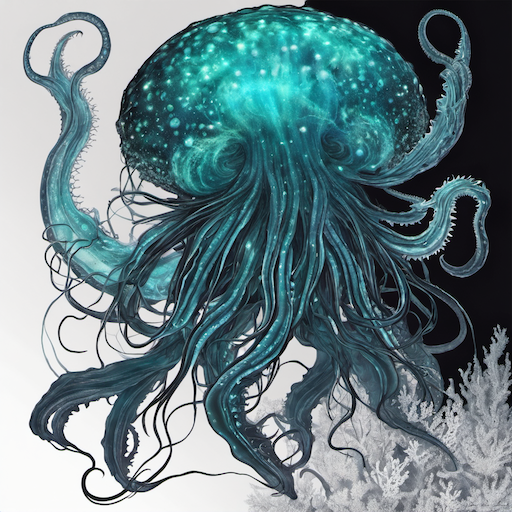
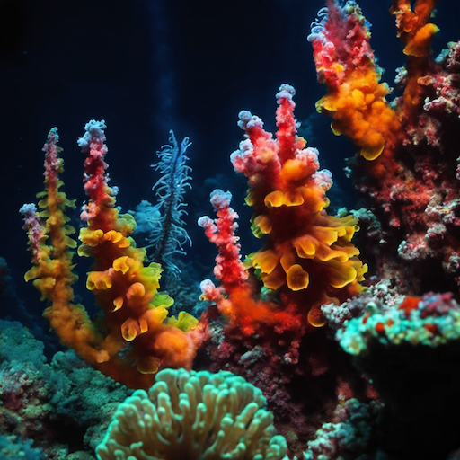
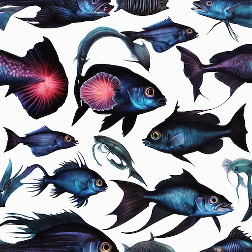
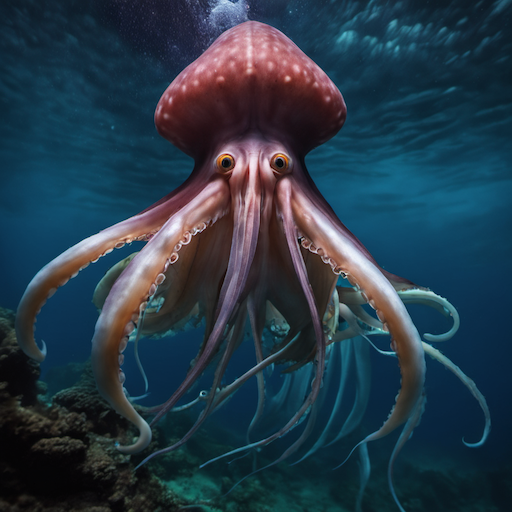
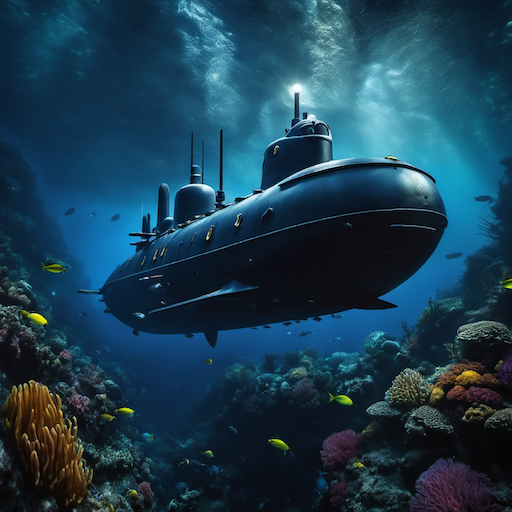

# Underwater & Marine Style Prompt Guide

## Core Principles

- **Aquatic Environment**: Water physics, light refraction, underwater atmosphere
- **Marine Life**: Authentic sea creatures, natural behavior, underwater ecosystems
- **Light and Color**: Underwater lighting, color absorption, depth effects
- **Ocean Dynamics**: Currents, waves, bubbles, underwater movement
- **Depth Perception**: Pressure effects, visibility, underwater scale

## Essential Prompt Structure

```text
[subject], [underwater elements], [depth], [lighting], [marine life], [artistic style], [technical quality]
```

## Advanced Techniques

### Underwater Lighting

- **Surface Light**: "sunlight through water", "light rays", "underwater caustics"
- **Depth Effects**: "deep blue", "pressure lighting", "depth gradient", "underwater shadows"
- **Artificial Light**: "underwater lights", "dive lights", "submarine lighting"
- **Bioluminescence**: "glowing", "bioluminescent", "deep sea light", "natural glow"

### Water Physics

- **Refraction**: "light refraction", "underwater distortion", "water lens effect"
- **Currents**: "underwater currents", "flowing water", "marine movement", "ocean flow"
- **Bubbles**: "air bubbles", "rising bubbles", "underwater bubbles", "oxygen bubbles"
- **Particles**: "suspended particles", "marine snow", "underwater debris", "floating matter"

### Depth and Visibility

- **Shallow Water**: "clear water", "shallow depth", "visible surface", "bright lighting"
- **Mid Depth**: "moderate depth", "blue tint", "reduced visibility", "underwater atmosphere"
- **Deep Water**: "deep ocean", "dark blue", "limited visibility", "pressure effects"
- **Abyssal**: "abyssal depth", "complete darkness", "bioluminescence", "deep sea"

## Style-Specific Modifiers

### Marine Environments

- **Coral Reefs**: "coral reef", "tropical fish", "colorful coral", "reef ecosystem"
- **Open Ocean**: "open water", "pelagic", "ocean blue", "marine environment"
- **Deep Sea**: "deep sea", "abyssal", "hydrothermal vents", "deep ocean"
- **Coastal**: "coastal waters", "shallow sea", "rocky bottom", "marine life"

### Marine Life Categories

- **Fish**: "tropical fish", "schooling fish", "predatory fish", "marine fish"
- **Mammals**: "dolphins", "whales", "seals", "marine mammals"
- **Invertebrates**: "jellyfish", "octopus", "squid", "marine invertebrates"
- **Crustaceans**: "crabs", "lobsters", "shrimp", "marine crustaceans"

### Underwater Activities

- **Diving**: "scuba diving", "underwater exploration", "dive equipment", "underwater adventure"
- **Submarines**: "submarine", "underwater vessel", "deep sea exploration", "marine technology"
- **Underwater Photography**: "underwater camera", "marine photography", "ocean documentation"
- **Marine Research**: "marine biology", "ocean research", "underwater science", "marine exploration"

## Negative Prompts

- "dry land", "terrestrial", "above water", "surface"
- "bright sunlight", "clear air", "dry environment", "land-based"
- "artificial", "man-made", "urban", "industrial"
- "dead", "polluted", "dirty water", "contaminated"

## Sample Prompts by Category

### Coral Reef Environments

1. **Vibrant Coral Reef**: "colorful coral reef, tropical fish, clear water, sunlight through surface, marine ecosystem"
2. **Reef Fish School**: "schooling tropical fish, coral background, underwater lighting, marine life, natural behavior"
3. **Coral Garden**: "underwater coral garden, diverse marine life, clear blue water, natural lighting, reef ecosystem"
4. **Anemone and Clownfish**: "clownfish in anemone, coral reef environment, underwater close-up, marine symbiosis"
5. **Reef Exploration**: "diver exploring coral reef, colorful marine life, underwater photography, marine adventure"

### Deep Sea Environments

6. **Abyssal Plain**: "deep sea environment, bioluminescent creatures, complete darkness, abyssal depth, marine life"
7. **Hydrothermal Vents**: "hydrothermal vents, deep sea ecosystem, chemosynthetic life, underwater geology"
8. **Deep Sea Fish**: "deep sea fish, bioluminescent, dark environment, pressure effects, abyssal creatures"
9. **Giant Squid**: "giant squid, deep ocean, mysterious creature, underwater encounter, marine biology"
10. **Deep Sea Exploration**: "submarine in deep sea, underwater lights, marine exploration, deep ocean environment"

## 10 Example Prompts

### 1. Vibrant Coral Reef

```text
A colorful coral reef with tropical fish, clear water, sunlight through surface, marine ecosystem, underwater photography style, high quality
```



### 2. Reef Fish School

```text
Schooling tropical fish with coral background, underwater lighting, marine life, natural behavior, underwater photography, high quality
```



### 3. Coral Garden

```text
An underwater coral garden with diverse marine life, clear blue water, natural lighting, reef ecosystem, underwater photography style, high quality
```



### 4. Anemone and Clownfish

```text
Clownfish in anemone, coral reef environment, underwater close-up, marine symbiosis, underwater photography, high quality
```



### 5. Reef Exploration

```text
A diver exploring coral reef, colorful marine life, underwater photography, marine adventure, underwater photography style, high quality
```



### 6. Abyssal Plain

```text
A deep sea environment with bioluminescent creatures, complete darkness, abyssal depth, marine life, underwater photography, high quality
```



### 7. Hydrothermal Vents

```text
Hydrothermal vents with deep sea ecosystem, chemosynthetic life, underwater geology, underwater photography style, high quality
```



### 8. Deep Sea Fish

```text
Deep sea fish with bioluminescence, dark environment, pressure effects, abyssal creatures, underwater photography, high quality
```



### 9. Giant Squid

```text
A giant squid in deep ocean, mysterious creature, underwater encounter, marine biology, underwater photography style, high quality
```



### 10. Deep Sea Exploration

```text
A submarine in deep sea, underwater lights, marine exploration, deep ocean environment, underwater photography, high quality
```



## Advanced Tips

- Research specific marine species and their habitats
- Consider water depth and its effects on light and color
- Use authentic underwater physics and lighting
- Include marine ecosystem relationships
- Respect marine life and avoid harmful stereotypes

## Common Mistakes

- Using surface lighting for underwater scenes
- Ignoring water physics and refraction
- Making underwater scenes too bright or clear
- Forgetting depth effects on color and visibility
- Using terrestrial animal poses for marine life

## Artist/Style References

- Underwater photography
- Marine biology documentaries
- Ocean exploration footage
- Marine art and illustration
- Underwater cinematography
- Marine conservation photography
- Deep sea exploration imagery
