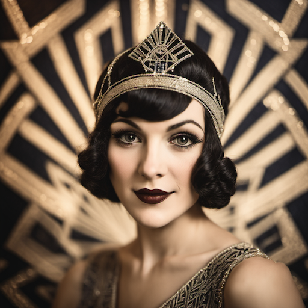
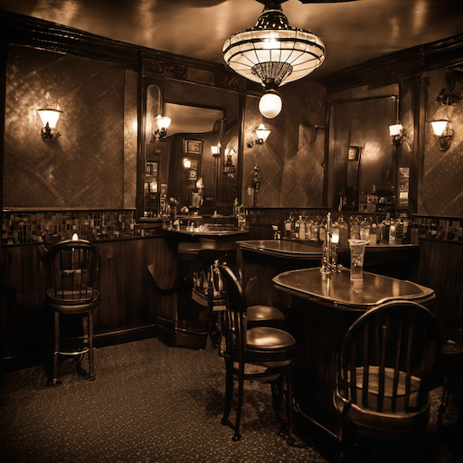
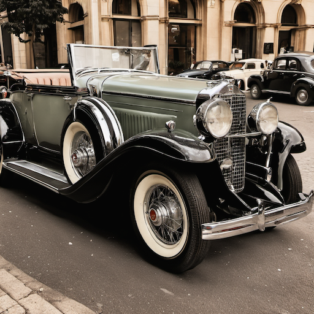
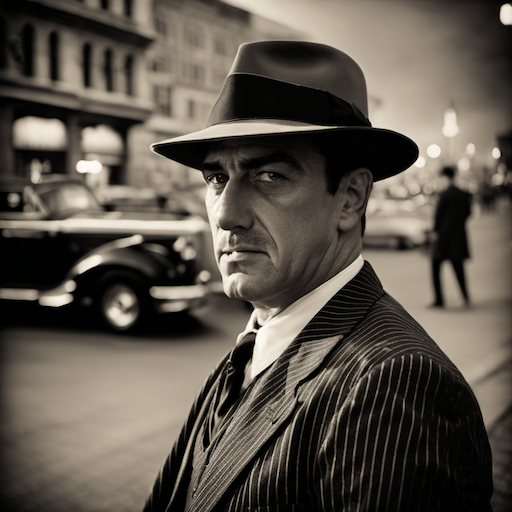
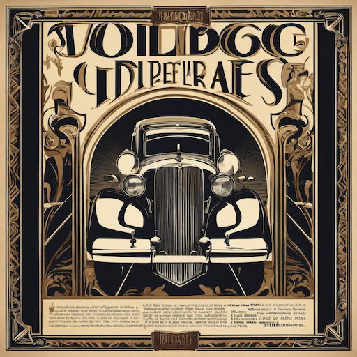
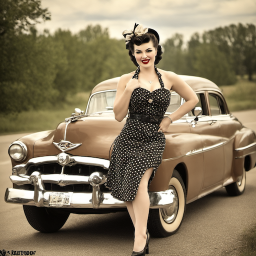
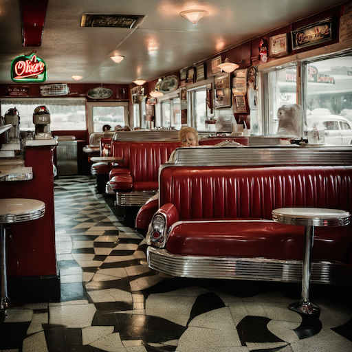
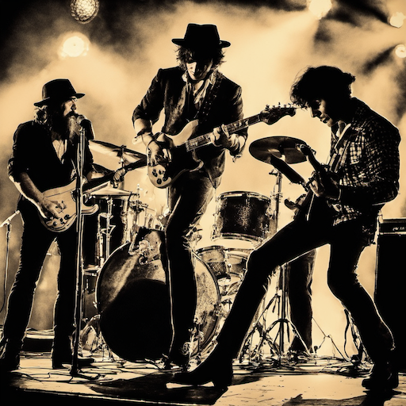
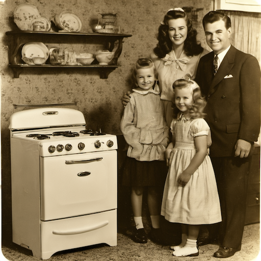
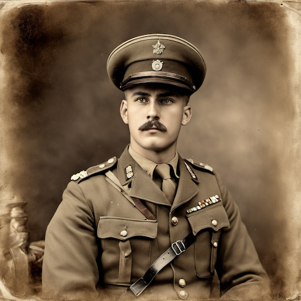

# Vintage & Retro Style Prompt Guide

## Core Principles

- **Historical Periods**: 1920s-1980s aesthetics, specific decade references
- **Nostalgic Feel**: Warm, comforting, familiar atmospheres
- **Period Accuracy**: Authentic clothing, technology, and design elements
- **Color Palettes**: Era-appropriate colors, film grain, vintage processing
- **Cultural References**: Music, fashion, technology, and lifestyle of the time

## Essential Prompt Structure

```text
[subject], [vintage/retro elements], [period], [materials], [lighting], [artistic style], [technical quality]
```

## Advanced Techniques

### Period-Specific Elements

- **1920s Art Deco**: "art deco", "flapper", "jazz age", "geometric patterns"
- **1930s Depression Era**: "dust bowl", "great depression", "vintage cars", "sepia tone"
- **1940s War Era**: "world war II", "pin-up", "vintage military", "black and white"
- **1950s Americana**: "rock and roll", "diners", "vintage cars", "suburban life"
- **1960s Counterculture**: "hippie", "psychedelic", "peace and love", "vintage rock"
- **1970s Disco**: "disco era", "bell bottoms", "platform shoes", "disco ball"
- **1980s Synthwave**: "synthwave", "neon", "retro gaming", "vintage computers"

### Vintage Photography Effects

- **Film Grain**: "film grain", "vintage film", "analog photography", "grainy texture"
- **Color Processing**: "kodachrome", "eastman color", "vintage color", "faded colors"
- **Sepia Tone**: "sepia", "brown tone", "vintage brown", "antique photo"
- **Black and White**: "vintage black and white", "classic monochrome", "silver gelatin"

### Materials and Textures

- **Vintage Materials**: "aged paper", "vintage fabric", "old leather", "patina"
- **Retro Patterns**: "vintage wallpaper", "retro patterns", "geometric designs", "floral prints"
- **Weathered Surfaces**: "weathered", "aged", "vintage wear", "distressed"
- **Period Technology**: "vintage electronics", "retro gadgets", "old machinery", "classic cars"

## Style-Specific Modifiers

### 1920s-1930s

- "art deco", "flapper", "jazz age", "prohibition era"
- "vintage cars", "speakeasy", "gangster", "vintage fashion"
- "geometric patterns", "deco architecture", "vintage luxury", "old money"

### 1940s-1950s

- "pin-up", "vintage military", "war era", "vintage advertising"
- "rock and roll", "vintage diner", "suburban life", "vintage family"
- "vintage cars", "classic automobiles", "vintage home", "mid-century modern"

### 1960s-1970s

- "hippie", "counterculture", "peace and love", "vintage rock"
- "disco era", "bell bottoms", "platform shoes", "vintage fashion"
- "psychedelic", "vintage concert", "vintage music", "retro lifestyle"

### 1980s-1990s

- "synthwave", "retro gaming", "vintage computers", "neon lights"
- "vintage arcade", "retro technology", "vintage electronics", "old school"
- "vintage fashion", "retro style", "vintage aesthetic", "nostalgic"

## Negative Prompts

modern, contemporary, current, present day, digital, high tech, futuristic, advanced, clean, minimalist, sleek, modern design, bright colors, vibrant, saturated, modern processing

## Sample Prompts by Category

### 1920s-1930s Era

1. **Art Deco Portrait**: "vintage portrait, art deco style, flapper dress, geometric background, vintage lighting, 1920s aesthetic"
2. **Speakeasy Scene**: "vintage speakeasy, jazz musicians, art deco interior, vintage lighting, prohibition era atmosphere"
3. **Vintage Car**: "classic vintage car, art deco design, chrome details, vintage street scene, 1930s aesthetic"
4. **Gangster Portrait**: "vintage gangster, pinstripe suit, fedora hat, vintage film noir lighting, 1920s style"
5. **Vintage Advertisement**: "vintage ad, art deco typography, vintage product, retro colors, 1930s advertising style"

### 1940s-1950s Era

6. **Pin-up Girl**: "vintage pin-up, 1940s style, retro fashion, vintage photography, classic beauty"
7. **Vintage Diner**: "classic diner, vintage interior, jukebox, vintage cars outside, 1950s aesthetic"
8. **Rock and Roll**: "vintage rock concert, 1950s musicians, vintage instruments, retro lighting, classic rock"
9. **Suburban Life**: "vintage suburban home, 1950s family, vintage appliances, retro lifestyle, classic americana"
10. **Vintage Military**: "vintage military portrait, 1940s uniform, vintage photography, war era, classic style"

## 10 Example Prompts

### 1. Art Deco Portrait

```text
A vintage portrait with art deco style, flapper dress, geometric background, vintage lighting, 1920s aesthetic, retro photography, high quality
```



### 2. Speakeasy Scene

```text
A vintage speakeasy with jazz musicians, art deco interior, vintage lighting, prohibition era atmosphere, 1920s style, high quality
```



### 3. Vintage Car

```text
A classic vintage car with art deco design, chrome details, vintage street scene, 1930s aesthetic, retro photography, high quality
```



### 4. Gangster Portrait

```text
A vintage gangster in pinstripe suit, fedora hat, vintage film noir lighting, 1920s style, retro photography, high quality
```



### 5. Vintage Advertisement

```text
A vintage ad with art deco typography, vintage product, retro colors, 1930s advertising style, vintage design, high quality
```



### 6. Pin-up Girl

```text
A vintage pin-up in 1940s style, retro fashion, vintage photography, classic beauty, pin-up art style, high quality
```



### 7. Vintage Diner

```text
A classic diner with vintage interior, jukebox, vintage cars outside, 1950s aesthetic, retro photography, high quality
```



### 8. Rock and Roll

```text
A vintage rock concert with 1950s musicians, vintage instruments, retro lighting, classic rock atmosphere, vintage style, high quality
```



### 9. Suburban Life

```text
A vintage suburban home with 1950s family, vintage appliances, retro lifestyle, classic americana, vintage photography, high quality
```



### 10. Vintage Military

```text
A vintage military portrait with 1940s uniform, vintage photography, war era atmosphere, classic style, retro photography, high quality
```



## Advanced Tips

- Research specific historical periods for accuracy
- Use authentic period-appropriate colors and materials
- Consider cultural and social context of the era
- Balance nostalgia with historical accuracy
- Include period-specific technology and fashion

## Common Mistakes

- Mixing elements from different eras
- Using modern colors in vintage contexts
- Ignoring historical accuracy
- Making everything too perfect or clean
- Forgetting period-appropriate technology

## Artist/Style References

- Norman Rockwell
- Edward Hopper
- Vintage photography
- Art Deco artists
- Mid-century modern design
- Vintage advertising art
- Classic film photography
